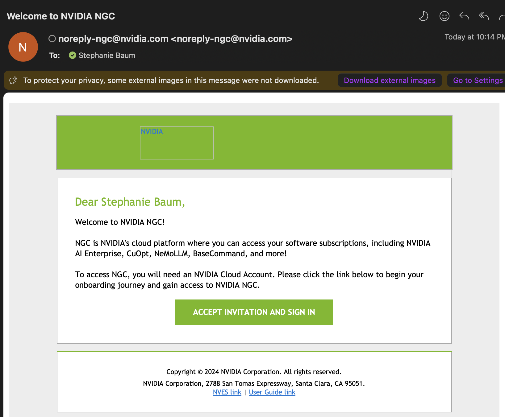

Hello World

# NGC Account Access [](\#ngc-account-access "Permalink to this headline")

NVIDIA Cloud Functions is hosted on NVIDIA’s NGC platform. This overview gives a quick run down on how to log in to your account the first time. For detailed instructions on adding and managing users within your organization as the organization owner, please see the [NGC User Guide](https://docs.nvidia.com/ngc/gpu-cloud/ngc-user-guide/index.html#accessing-ngc-org-owner).

When you are invited to an NGC organization with the Cloud Functions product enabled on it, your Cloud Functions account will be tied to both an NGC organization, and an NCA (NVIDIA Cloud Account) ID.

## Login as the Organization Owner [](\#login-as-the-organization-owner "Permalink to this headline")

1. The organization owner will receive an automated invite that looks like the following:

1. Clicking the button to log in will take you to a page that looks like the following. **From here please click “Create NVIDIA Cloud Account”.**

1. The next step will then ask you to enter an account name for your NCA. This account name will be linked to your NGC organization.

1. After completing Step 3 you will be redirected to your new NGC organization.

> - Access Cloud Functions on the upper left navigation.
>
> - Access your Organization Profile page, which includes your NGC organization details including your NVIDIA Cloud Account (NCA) ID by clicking “Organization” - “Organization Profile” from the navigation on the top right.

1. You will receive another email asking to log in to finish setup. This step activates your NVIDIA Cloud Account for future use. Click the button to login.

