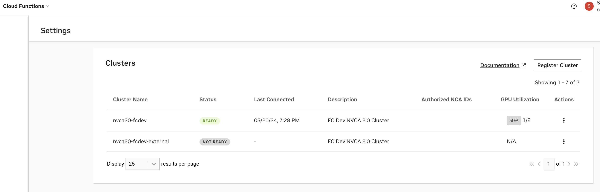
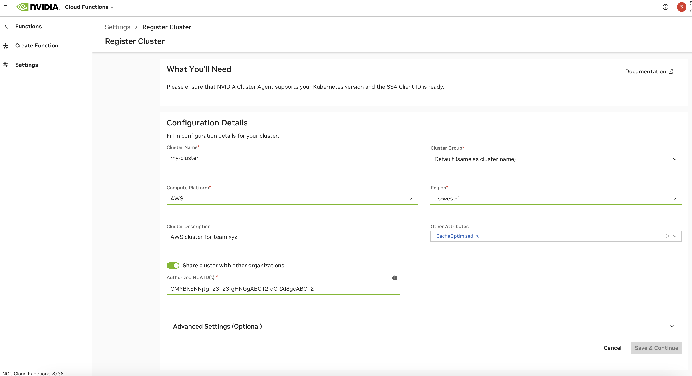
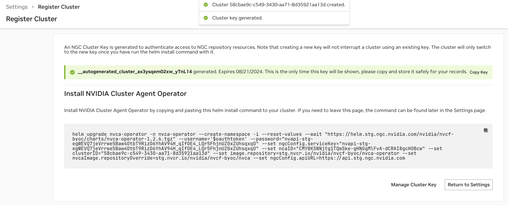
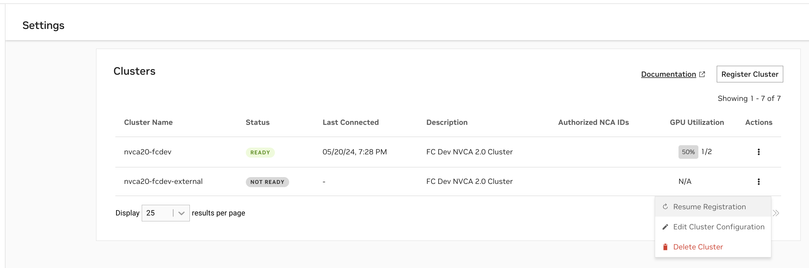
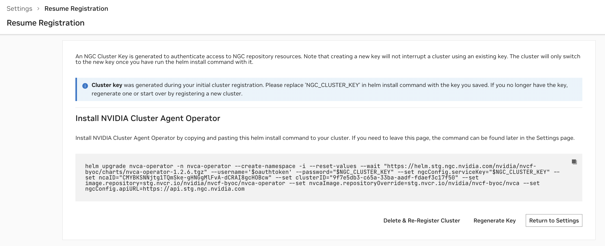

Hello World

# Cluster Setup & Management [](\#cluster-setup-management "Permalink to this headline")

Cloud Functions admins can install the NVIDIA Cluster Agent to enable existing GPU Clusters to act as deployment targets for NVCF functions. The NVIDIA Cluster Agent is a function deployment orchestrator that communicates with the NVCF control plane. This page describes how to do the following:

- Register a cluster with NVCF using the NVIDIA Cluster Agent.

- Configure the cluster by defining GPU instance types, configurations, regions, and authorized NCA (NVIDIA Cloud Account) IDs.

- Verify the cluster setup was successful.


After installing the NVIDIA Cluster Agent on a cluster:

- The registered cluster will show as a deployment option in the `GET /v2/nvcf/clusterGroups` API response, and Cloud Functions deployment menu.

- Any functions under the cluster’s authorized NCA IDs can now deploy on the cluster.


## Prerequisites [](\#prerequisites "Permalink to this headline")

- Access to a Kubernetes cluster including GPU-enabled nodes (“GPU cluster”)


> - The cluster must have a compatible version of [Kubernetes](https://kubernetes.io/releases/).
>
> - The cluster must have the [NVIDIA GPU Operator](https://docs.nvidia.com/datacenter/cloud-native/gpu-operator/latest/getting-started.html#operator-install-guide) installed.
>
>
>   > - If your cloud provider _does not_ support the NVIDIA GPU Operator, [Manual Instance Configuration](#manual-config) is possible, but **not recommended** due to lack of maintainability.

- Registering the cluster requires `kubectl` and `helm` installed.

- The user registering the cluster must have the `cluster-admin` role privileges to install the NVIDIA Cluster Agent Operator ( `nvca-operator`).

- The user registering the cluster must have the Cloud Functions Admin role within their NGC organization.


### Supported Kubernetes Versions [](\#supported-kubernetes-versions "Permalink to this headline")

- Minimum Kubernetes Supported Version: `v1.25.0`

- Maximum Kubernetes Supported Version `v1.29.x`


### Considerations [](\#considerations "Permalink to this headline")

- The NVIDIA Cluster Agent currently only supports caching if the cluster is enabled with `StorageClass` configurations. If the “Caching Support” capability is enabled, the agent will make the best effort by attempting to detect storage during deployments and fall back on non-cached workflows.

- All NVIDIA-managed clusters support autoscaling functionality fully for all heuristics. However, clusters registered to NVCF via the agent only support autoscaling via the function queue depth heuristic.


## Register the Cluster [](\#register-the-cluster "Permalink to this headline")

Reach the cluster registration page by navigating to Cloud Functions in the NGC product dropdown, and choosing “Settings” on the left-hand menu. You must be a Cloud Functions Admin to see this page. Choose “Register Cluster” to begin the registration process.



### Configuration [](\#configuration "Permalink to this headline")



See below for descriptions of all cluster configuration options.

| Field | Description |
| --- | --- |
| Cluster Name | The name for the cluster. This field is not changeable once configured. |
| Cluster Group | The name of the cluster group.<br>This is usually identical to the cluster name, except in cases when there are multiple clusters you’d like to group. This would be done to enable a function to deploy on any of the clusters when the group is selected (for example, due to identical hardware support). |
| Compute Platform | The cloud platform the cluster is deployed on. This field is a standard part of the node name label format that the cluster agent uses: <Platform>.GPU.<GPUName> |
| Region | The region the cluster is deployed in. This field is required for enabling future optimization and configuration when deploying functions. |
| Cluster Description | Optional description for the cluster, this provides additional context about the cluster and will be returned in the cluster list under the Settings page, and the `/listClusters` API response. |
| Other Attributes | Tag your cluster with additional properties.<br>**CacheOptimized**: Enables rapid instance spin-up, requires extra storage configuration and caching support attributed in the Advanced Cluster Setup - See [Advanced Settings](#advanced-settings).<br>**KataRunTimeIsolation**: Cluster is equipped with enhanced setup to ensure superior workload isolation using [Kata Containers](https://katacontainers.io/). |

Elevating efficiency for rapid instance spin-up, mandating extra storage configuration and caching support attribute in Advanced cluster setup.

By default, the cluster will be authorized to the NCA ID of the current NGC organization being used during cluster configuration. If you choose to share the cluster with other NGC organizations, you will need to retrieve their corresponding NCA IDs. Sharing the cluster will allow other NVCF accounts to deploy cloud functions on it, with no limitations on how many GPUs within the cluster they deploy on.

Note

NVCF “accounts” are directly tied to, and defined by, NCA IDs (“NVIDIA Cloud Account”). Each NGC organization, with access to the Cloud Functions UI, has a corresponding NGC Organization Name and NCA ID. Please see the [NGC Organization Profile Page](https://org.ngc.nvidia.com/profile) to find these details.

Warning

Once functions from other NGC organizations have been deployed on the cluster, removing them from the authorized NCA IDs list, or removing sharing completely from the cluster, can cause disruption of service. Ideally, any functions tied to other NCA IDs should be undeployed before the NCA ID is removed from the authorized NCA IDs list.

### Advanced Settings [](\#advanced-settings "Permalink to this headline")


See below for descriptions of all capability options in the “Advanced Settings” section of the cluster configuration. Note that for customer-managed clusters (registered via the Cluster Agent) Dynamic GPU Discovery is enabled by default. For NVIDIA internal clusters, Collect Function Logs is also enabled by default.

| Capability | Description |
| --- | --- |
| Dynamic GP Discovery | Enables automatic detection and management of allocatable GPU capacity within the cluster via the NVIDIA GPU Operator.<br>This capability is **strongly recommended** and would only be disabled in cases where [Manual Instance Configuration](#manual-config) is required. |
| Collect Function Logs | This capability enables the emission of comprehensive Cluster Agent logs, which are then forwarded to the NVIDIA internal team, aiding in diagnosing<br>and resolving issues effectively. When enabled these will not be visible in the UI, but are always available by<br>[running commands to retrieve logs](#nvca-logs) directly on the cluster. |
| Caching Support | Enhances application performance by storing frequently accessed data (models, resources and containers) in a cache. See [Caching Support](#cluster-caching). |

Note

Removing the Dynamic GPU Discovery will require manual instance configuration. See [Manual Instance Configuration](#manual-config).

#### Caching Support [](\#caching-support "Permalink to this headline")

Enabling caching for models, resources and containers is recommended for optimal performance. You must create `StorageClass` configurations for caching within your cluster to fully enable “Caching Support” with the Cluster Agent. See examples below:

**StorageClass Configurations in GCP**

nvcf-sc.yaml [](#id5 "Permalink to this code")

```
 1kind: StorageClass
 2apiVersion: storage.k8s.io/v1
 3metadata:
 4    name: nvcf-sc
 5provisioner: pd.csi.storage.gke.io
 6allowVolumeExpansion: true
 7volumeBindingMode: Immediate
 8reclaimPolicy: Retain
 9parameters:
10    type: pd-ssd
11    csi.storage.k8s.io/fstype: xfs
```

nvcf-cc-sc.yaml [](#id6 "Permalink to this code")

```
 1kind: StorageClass
 2apiVersion: storage.k8s.io/v1
 3metadata:
 4    name: nvcf-cc-sc
 5provisioner: pd.csi.storage.gke.io
 6allowVolumeExpansion: true
 7volumeBindingMode: Immediate
 8reclaimPolicy: Retain
 9parameters:
10    type: pd-ssd
11    csi.storage.k8s.io/fstype: xfs
```

Note

GCP currently allows only [10 VM’s](https://cloud.google.com/compute/docs/disks#:~:text=You%20can%20attach%20a%20balanced,VMs%20in%20read%2Donly%20mode) to mount a Persistent Volume in Read-Only mode.

**StorageClass Configurations in Azure**

nvcf-sc.yaml [](#id7 "Permalink to this code")

```
 1kind: StorageClass
 2apiVersion: storage.k8s.io/v1
 3metadata:
 4    name: nvcf-sc
 5provisioner: file.csi.azure.com
 6allowVolumeExpansion: true
 7volumeBindingMode: Immediate
 8reclaimPolicy: Retain
 9parameters:
10    skuName: Standard_LRS
11    csi.storage.k8s.io/fstype: xfs
```

nvcf-cc-sc.yaml [](#id8 "Permalink to this code")

```
 1kind: StorageClass
 2apiVersion: storage.k8s.io/v1
 3metadata:
 4    name: nvcf-cc-sc
 5provisioner: file.csi.azure.com
 6allowVolumeExpansion: true
 7volumeBindingMode: Immediate
 8reclaimPolicy: Retain
 9parameters:
10    skuName: Standard_LRS
11    csi.storage.k8s.io/fstype: xfs
```

**Apply the StorageClass Configurations**

Save the StorageClass template to files `nvcf-sc.yaml` and `nvcf-cc-sc.yaml` and apply them as:

```
1kubectl create -f nvcf-sc.yaml
2kubectl create -f nvcf-cc-sc.yaml
```

### Install the Cluster Agent [](\#install-the-cluster-agent "Permalink to this headline")



After configuring the cluster, an NGC Cluster Key will be generated for authenticating to NGC, and you will be presented with a command snippet for installing the NVIDIA Cluster Agent Operator. Please refer to this command snippet for the most up-to-date installation instructions.

Note

The NGC Cluster Key has a default expiration of 90 days. Either on a regular cadence or when nearing expiration, you must [rotate your NGC Cluster Key](#cluster-key-rotation).

Once the Cluster Agent Operator installation is complete, the operator will automatically install the desired NVIDIA Cluster Agent version and the Status of the cluster in the Cluster Page will become “Ready”.

Afterward, you will be able to modify the configuration at any time. The cluster name and SSA client ID (only available for NVIDIA internal clusters) are not reconfigurable. Please refer to any additional installation instructions for reconfiguration in the UI. Once the configuration is updated, the Cluster Agent Operator, which polls for changes every 15 minutes, will apply the new configuration.

## View & Validate Cluster Setup [](\#view-validate-cluster-setup "Permalink to this headline")

### Verify Cluster Agent Installation via UI [](\#verify-cluster-agent-installation-via-ui "Permalink to this headline")

At any time, you can view the clusters you have begun registering, or registered, along with their status, on the Settings page.



- A status of `Ready` indicates the Cluster Agent has registered the cluster with NVCF successfully.

- A status of `Not Ready` indicates the registration command has either just been applied and is in progress, or that registration is failing.


In cases when registration is failing, please use the following command to retrieve additional details:

```
1kubectl get nvcfbackend -n nvca-operator
```

When a cluster is `Not Ready`, you can resume registration at any time to finish the installation.

The “GPU Utilization” column is based on the number of GPUs occupied over the number of GPUs available within the cluster. The “Last Connected” column indicates when the last status update was received from the Cluster Agent to the NVCF control plane.

### Verify Cluster Agent Installation via Terminal [](\#verify-cluster-agent-installation-via-terminal "Permalink to this headline")

Verify the installation was successful via the following command, you should see a “healthy” response, as in this example:

```
1> kubectl get nvcfbackend -n nvca-operator
2NAME AGE VERSION HEALTH
3nvcf-trt-mgpu-cluster 3d16h 2.30.4 healthy
```

## Cluster Agent Monitoring and Reliability [](\#cluster-agent-monitoring-and-reliability "Permalink to this headline")

### Monitoring Data [](\#monitoring-data "Permalink to this headline")

#### Metrics [](\#metrics "Permalink to this headline")

The cluster agent and operator emit Prometheus-style metrics. The following metrics and labels are available by default.

| Metric Name | Metric Description |
| --- | --- |
| nvca\_event\_queue\_length | The length of a named event queue |
| nvca\_event\_process\_latency | The amount of time for processing an event in NVCA |

| Metric Label | Metric Label Description |
| --- | --- |
| nvca\_event\_name | The name of the event |
| nvca\_nca\_id | The NCA ID of this NVCA instance |
| nvca\_cluster\_name | The NVCA cluster name |
| nvca\_cluster\_group | The NVCA cluster group |
| nvca\_version | The NVCA version |

Cluster maintainers can scrape the available metrics using the following examples of a PodMonitor for NVCA Operator and ServiceMonitor for NVCA for reference:

**Sample NVCA Operator PodMonitor**

```
 1apiVersion: monitoring.coreos.com/v1
 2kind: PodMonitor
 3metadata:
 4    labels:
 5        app.kubernetes.io/component: metrics
 6        app.kubernetes.io/instance: prometheus-agent
 7        app.kubernetes.io/name: metrics-nvca-operator
 8        jobLabel: metrics-nvca-operator
 9        release: prometheus-agent
10        prometheus.agent/podmonitor-discover: "true"
11    name: metrics-nvca-operator
12    namespace: monitoring
13spec:
14    podMetricsEndpoints:
15    - port: http
16        scheme: http
17        path: /metrics
18    jobLabel: jobLabel
19    selector:
20        matchLabels:
21            app.kubernetes.io/name: nvca-operator
22    namespaceSelector:
23        matchNames:
24        - nvca-operator
```

**Sample NVCA ServiceMonitor**

```
 1apiVersion: monitoring.coreos.com/v1
 2kind: ServiceMonitor
 3metadata:
 4    labels:
 5        app.kubernetes.io/component: metrics
 6        app.kubernetes.io/instance: prometheus-agent
 7        app.kubernetes.io/name: metrics-nvca
 8        jobLabel: metrics-nvca
 9        release: prometheus-agent
10        prometheus.agent/servicemonitor-discover: "true"
11    name: prometheus-agent-nvca
12    namespace: monitoring
13spec:
14    endpoints:
15    - port: nvca
16    jobLabel: jobLabel
17    selector:
18        matchLabels:
19            app.kubernetes.io/name: nvca
20    namespaceSelector:
21        matchNames:
22        - nvca-system
```

#### Logs [](\#logs "Permalink to this headline")

Both the Cluster Agent and Cluster Agent Operator emit logs locally by default.

Local logs for the NVIDIA Cluster Agent Operator can be obtained via `kubectl`:

```
1kubectl logs -l app.kubernetes.io/instance=nvca-operator -n nvca-operator --tail 20
```

Similarly, NVIDIA Cluster Agent logs can be obtained with the following command via kubectl:

```
1kubectl logs -l  app.kubernetes.io/instance=nvca -n nvca-system --tail 20
```

Warning

Current function-level inference container logs are **not supported** for functions deployed on non-NVIDIA-managed clusters. Customers are encouraged to emit logs directly from their inference containers running on their own clusters to any third-party tool, there are no public egress limitations for containers.

#### Tracing [](\#tracing "Permalink to this headline")

The NVIDIA Cluster Agent provides OpenTelemetry integration for exporting traces and events to compatible collectors. As of agent version 2.0, the only supported collector is Lightstep. See [Advanced: NVCA Operator Configuration Options](#advanced-config).

### Cluster Key Rotation [](\#cluster-key-rotation "Permalink to this headline")

To regenerate or rotate a cluster’s key, choose the “Regenerate Key” option from the Clusters table on the Settings page. Please refer to this command snippet for the most up-to-date upgrade instructions.

Warning

Updating your Service Key may interrupt any in-progress updates or deployments to existing functions, therefore it’s important to pause deployments before upgrading.


## Advanced: NVCA Operator Configuration Options [](\#advanced-nvca-operator-configuration-options "Permalink to this headline")

Below are additional configuration options for reference purposes.

### Node Affinity [](\#node-affinity "Permalink to this headline")

The cluster agent determines which GPU nodes are schedulable for Cloud Function workloads using [node affinity](https://kubernetes.io/docs/tasks/configure-pod-container/assign-pods-nodes-using-node-affinity/).

For example, to mark all nodes as schedulable in a cluster:

```
1kubectl label nodes -l 'nvidia.com/gpu.present=true' nvca.nvcf.nvidia.io/schedule=true
```

To mark a single node as unschedulable / cordoned:

```
1kubectl label node <node-name> nvca.nvcf.nvidia.io/schedule-
```

### NVCA Operator Parameters [](\#nvca-operator-parameters "Permalink to this headline")

| Name | Description | Value |
| --- | --- | --- |
| image.repository | NVCA Operator container registry path, without tag | nvcr.io/nvidia/nvcf-byoc/nvca-operator |
| image.tag | NVCA Operator container image tag. This defaults to the chart version | “” |
| image.pullPolicy | K8s `ImagePullPolicy` | IfNotPresent |
| nvcaImage.repositoryOverride | (Optional) Full NVCA container registry path, without tag. Only set this if the default needs to be overridden, for example, “nvcr.io/nvidia/nvcf-byoc/nvca”. The tag is set in the cluster config | “” |
| nvcaImage.pullPolicy | K8s `ImagePullPolicy` | IfNotPresent |
| replicaCount | Replica count for the operator deployment | 1 |
| systemNamespace | Namespace in which NVCFBackend objects are created. | nvca-operator |
| logLevel | Logging level for the module | info |
| ncaID | NVIDIA Cloud Account ID of the Primary Account | “” |
| clusterID | ID of the Cluster for this NVCA instance to manage | “” |
| clusterName | For metrics & telemetry | “” |
| k8sVersionOverride | Override the K8s version that NVCA registers with | “” |
| priorityClassName | K8s `PriorityClassName` for pod preference during evictions | “” |
| skipFluxInit | Skip Flux install if admin already has one installed | false |

### NGC Configuration [](\#ngc-configuration "Permalink to this headline")

| Name | Description | Value |
| --- | --- | --- |
| ngcConfig.username | Username for the registry authentication | $oauthtoken |
| ngcConfig.serviceKey | ServiceKey (password) for authentication | “” |
| ngcConfig.apiURL | NGC API URL for requesting auth tokens | [https://api.ngc.nvidia.com](https://api.ngc.nvidia.com) |

### Node Selector Configuration [](\#node-selector-configuration "Permalink to this headline")

| Name | Description | Value |
| --- | --- | --- |
| nodeSelector.key | Node-selector Label key | node.kubernetes.io/instance-type |
| nodeSelector.value | Node-selector Label value | “” |

### OpenTelemetry Configuration [](\#opentelemetry-configuration "Permalink to this headline")

| Name | Description | Value |
| --- | --- | --- |
| otel.enabled | Enable OpenTelemetry. | false |
| otel.lightstep.serviceName | the name of the Lightstep service to push telemetry data to | “” |
| otel.lightstep.accessToken | the access token for accessing the Lightstep API | “” |

## Advanced: Manual Instance Configuration [](\#advanced-manual-instance-configuration "Permalink to this headline")

Warning

It is **highly recommended** to rely on the Dynamic GPU Discovery, and therefore the NVIDIA GPU Operator, as manual instance configuration is error-prone.

This type of configuration is only necessary when the cluster Cloud Provider does not support the NVIDIA GPU Operator.

To enable manual instance configuration, remove the “Dynamic GPU Discovery” capability.


All fields in the generated example configuration in the UI are required. Start by choosing “Apply Example” to copy over the example configuration, and then modify it to your cluster’s instance specifications.


