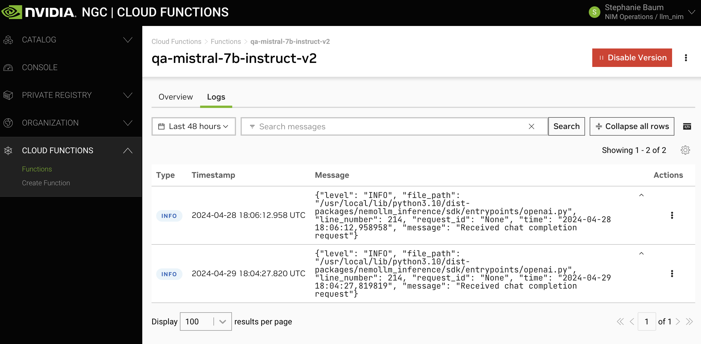
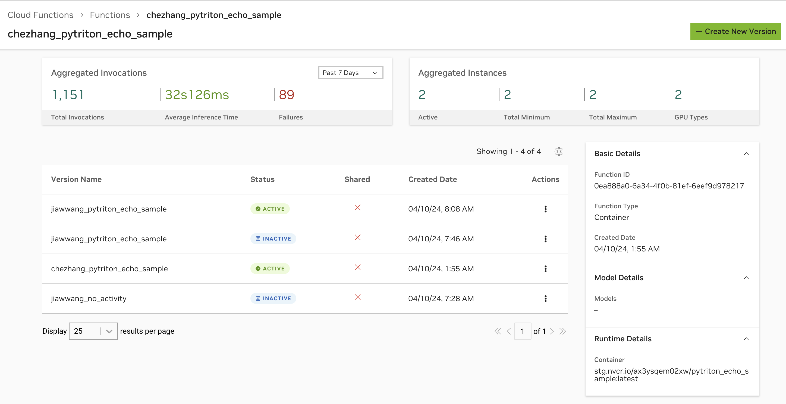
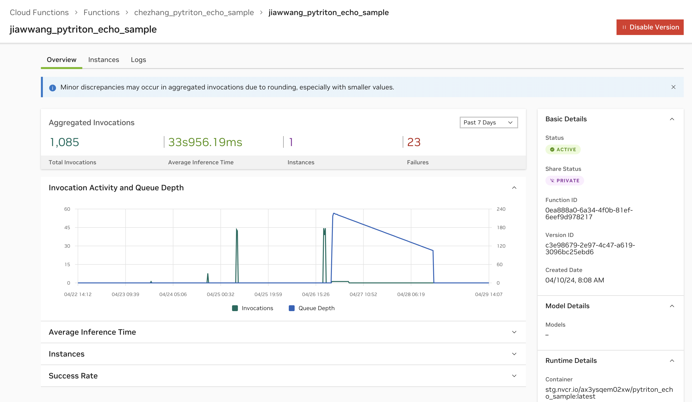

Hello World

# Function Monitoring [](\#function-monitoring "Permalink to this headline")

## Troubleshooting [](\#troubleshooting "Permalink to this headline")

For troubleshooting deployment failures see [Deployment Failures](function-deployment.html#deployment-failures).

For troubleshooting invocation failures see [Statuses and Errors](api.html#invocation-errors).

See below for adding logging to your inference container, and viewing metrics.

## Logging and Metrics [](\#logging-and-metrics "Permalink to this headline")

This section gives an overview of available metrics and logs within the Cloud Functions UI. Note that for full observability of production workloads, it’s recommended to emit logs, metrics, analytics etc. to third-party monitoring tools from within your container.

### Emit and View Inference Container Logs [](\#emit-and-view-inference-container-logs "Permalink to this headline")

View inference container logs in the Cloud Functions UI via the “Logs” tab in the function details page. To get here, click any function version from the “Functions” list and click “View Details” on the side panel to the right.



Logs are currently available with up to 48 hours history, with the ability to view as expanded rows for scanning, or as a “window” view for ease of copying and pasting.

Warning

Note as a prerequisite, your inference container will have to be instrumented to emit logs. This is highly recommended.

#### How to Add Logs to Your Inference Container [](\#how-to-add-logs-to-your-inference-container "Permalink to this headline")

Here is an example of adding NVCF-compatible logs. The helper function for logging below, along with other helper functions, can be imported from the [Helper Functions](https://github.com/NVIDIA/nv-cloud-function-helpers/blob/6996576e3e5c70a2d02e6e326c77327ed385db69/nv_cloud_function_helpers/nvcf_container/helpers.py#L85) repository.

```
 1 import logging
 2
 3 def get_logger() -> logging.Logger:
 4     """
 5     gets a Logger that logs in a format compatible with NVCF
 6     :return: logging.Logger
 7     """
 8     sys.stdout.reconfigure(encoding="utf-8")
 9     logging.basicConfig(
10         level=logging.INFO,
11         format="%(asctime)s [%(levelname)s] [INFERENCE] %(message)s",
12         handlers=[logging.StreamHandler(sys.stdout)],
13     )
14     logger = logging.getLogger(__name__)
15     return logger
16
17 class MyServer:
18
19     def __init__(self):
20         self.logger = get_logger()
21
22     def _infer_fn(self, request):
23         self.logger.info("Got a request!")
```

### View Function Metrics [](\#view-function-metrics "Permalink to this headline")

NVCF exposes the following metrics by default.

- Instance counts (current, min and max)

- Invocation activity and queue depth

- Total invocation count, success rate and failure count

- Average inference time


Metrics are viewable upon clicking any function from the “Functions” list page. The function overview page will display aggregated values across all function versions.



When clicking on a function version’s details page, you will then see metrics for this specific function version.



Warning

**There may be up to a 5-minute delay on metric ingestion.** Any time-series queries within the page are aggregated at 5-minute intervals with a step set to show 500 data points. All stat queries are based on the total selected period and reduced to either show the latest total value or a mean value.

### Instrument with OpenTelemetry [](\#instrument-with-opentelemetry "Permalink to this headline")

Users can (auto)instrument their container functions with OpenTelemetry SDK and have the signals (logs, traces and metrics) to observability backend such as Grafana Cloud.

See examples of container functions in [GitHub](https://github.com/NVIDIA/nv-cloud-function-helpers/tree/main/examples/otlp_exporter_sample).

## Logging and Metrics (Internal) [](\#logging-and-metrics-internal "Permalink to this headline")

Internal NVIDIAN users have access to additional logging and metrics. Refer to [Function Monitoring & Reliability](https://nvidia.sharepoint.com/sites/NVCloudFunctions/SitePages/Function-Monitoring-Best-Practices.aspx).

Besides additional logging and metrics, internal NVIDIAN users can leverage a Helm Chart Observability <https://gitlab-master.nvidia.com/nvcf/monitoring/helm-chart-observability#helm-chart-observability> to collect and export metrics and traces from their Helm Chart functions to Kratos and Lightstep.

Documentation for this Helm Chart is available [here](https://gitlab-master.nvidia.com/nvcf/monitoring/helm-chart-observability#how-to-use).


