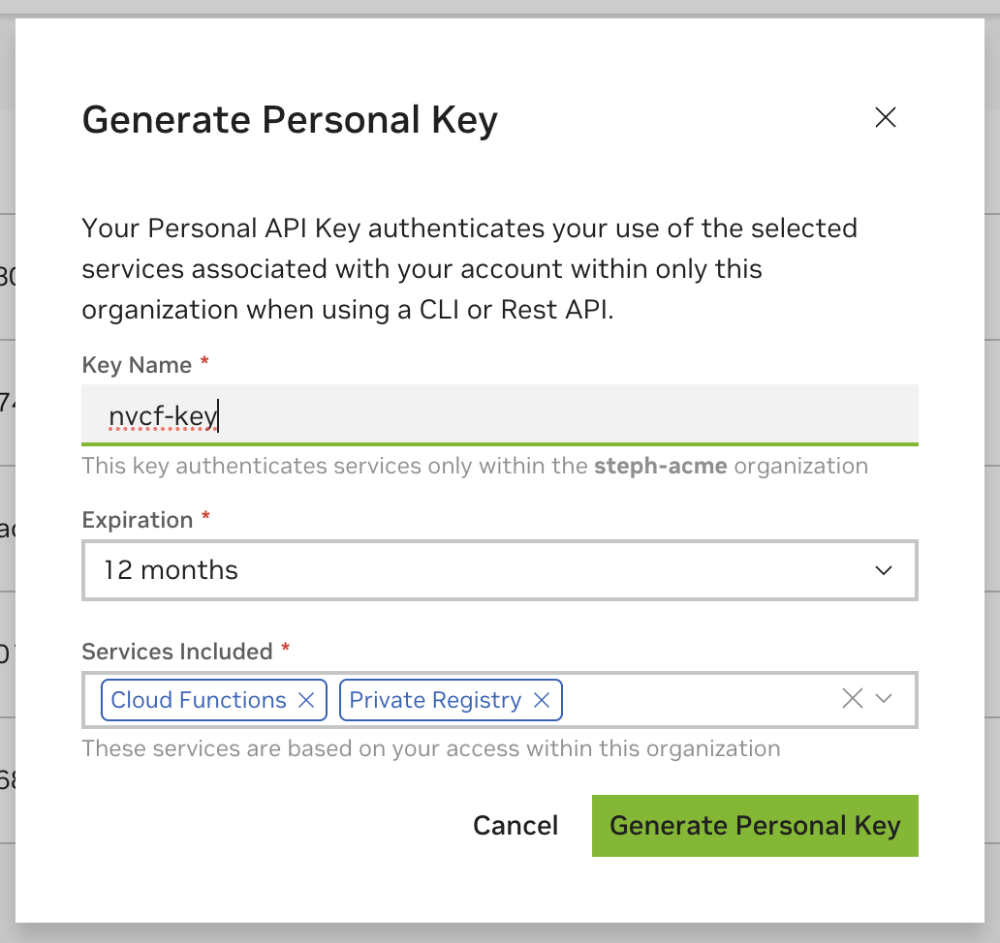

Hello World

## OpenAPI Specification [](\#openapi-specification "Permalink to this headline")

This page is a brief overview of using the NVCF API and does not cover all endpoints.

Please refer to the [OpenAPI Spec](https://api.nvcf.nvidia.com/v3/openapi) for the latest API information. The quickest way to begin using NVCF APIs is via the [`Postman Collection`](../_downloads/4f273de9a4ca3c4b8d1894c7b2f80907/postman.json).

The NVCF API is divided into the following sets of APIs:

| APIs | Usage |
| --- | --- |
| Function Invocation | Execution of a function that runs on a worker node. Usually an inference call. |
| Asset Management | Used to manage large files for uploading for a requested and downloading results of a function. |
| Cluster Groups & GPUs | Defines endpoints to list Cluster Groups and GPUs as targets for function deployment. |
| Queue Details | Used to view information about your environment such as queues & GPUs. |
| Function Management | The creation, modification and deletion of functions |
| Function Deployment | Endpoints for creating and managing function deployments. |

**API Versioning**

All API endpoints include versioning in the path prefix.

```
/v2/nvcf
```

## Authorization [](\#authorization "Permalink to this headline")

The NVCF API supports NGC API key-based authorization for calling the API directly, or indirectly via the [NGC CLI](https://docs.ngc.nvidia.com/cli/cmd_cloud-function.html) and [NGC SDK](https://docs.ngc.nvidia.com/sdk/).

The generated NGC Personal API Key will also be used for pushing and pulling containers, models, resources and helm charts to the [NGC Private Registry](https://docs.nvidia.com/ngc/gpu-cloud/ngc-private-registry-user-guide/index.html#using-ngc-registry-from-docker-command-line) to use during function creation.

### Generate an NGC Personal API Key [](\#generate-an-ngc-personal-api-key "Permalink to this headline")

The API Key can be generated via your account in the [Personal Keys Page](https://org.ngc.nvidia.com/setup/personal-keys).



It’s recommended that the API Key that you generate includes both **Cloud Functions and Private Registry scopes** for seamless usage with the [NGC CLI](https://docs.ngc.nvidia.com/cli/cmd_cloud-function.html).

Warning

API Key scopes are static. This means if the key is lost, it must be destroyed and recreated.

For more information about NGC API Key management see the [NGC API Key documentation](https://docs.nvidia.com/ngc/gpu-cloud/ngc-user-guide/index.html#ngc-api-keys).

**API Key Usage**

The API Key is passed in the `Authorization` header.

```
Authorization: Bearer $API_KEY
```

There are multiple API key types within NGC. We strongly recommend using the NGC Personal API Key for complete NVCF API compatibility.

Required domain names are documented below and are also pre-filled within our [`Postman Collection`](../_downloads/4f273de9a4ca3c4b8d1894c7b2f80907/postman.json).

Our [OpenAPI Spec](https://api.nvcf.nvidia.com/v3/openapi) also describes the scopes required for each endpoint.

| Scope Name | Domain Name | API Category |
| --- | --- | --- |
| update\_function | [https://api.ngc.nvidia.com](https://api.ngc.nvidia.com) | Function Management |
| register\_function | [https://api.ngc.nvidia.com](https://api.ngc.nvidia.com) | Function Management |
| queue\_details | [https://api.nvcf.nvidia.com](https://api.nvcf.nvidia.com) | Queue Details |
| list\_functions | [https://api.nvcf.nvidia.com](https://api.nvcf.nvidia.com) | Function Management |
| list\_cluster\_groups | [https://api.ngc.nvidia.com](https://api.ngc.nvidia.com) | Cluster Groups and GPUs |
| invoke\_function | [https://api.nvcf.nvidia.com](https://api.nvcf.nvidia.com) | Function Invocation and Asset Management |
| deploy\_function | [https://api.ngc.nvidia.com](https://api.ngc.nvidia.com) | Function Deployment |
| delete\_function | [https://api.ngc.nvidia.com](https://api.ngc.nvidia.com) | Function Management |

### JWT Based Authorization [](\#jwt-based-authorization "Permalink to this headline")

The NVCF API also supports JWT-based authorization for all endpoints. This is managed via the creation of a Service Account Client associated with your organization. A signed JWT issued by the NVCF Service Account authorizes against the Cloud Functions API. This token is obtained by posting the Client’s `clientId` and `secret` along with the required scopes to the Service Account.

When the token expires, the client application will need to generate a new token. Secrets also expire on a regular cadence and require rotation.

Warning

This type of authorization requires additional maintenance due to token generation and key rotation.

Speak with your Account Manager if you need access to a Service Account Client for JWT-based authorization.

**JWT Token Generation**

When generating a token, the client application can specify only the scopes that are needed to perform the desired operations, limiting the “blast radius” if the token is leaked. The token will expire by default within **15 minutes.**

The token generation endpoint `jwtTokenProvider`, `clientId`, and `secret` will be shared with you during the Service Account Client setup.

Note

It’s a best practice to only request the scopes your client needs each time when generating a token.

See [API Key Scopes and Domains](#scopes) for all available scopes. The `Authorization` header is a base64 encoded string of the following format: `clientId:secret` Here is an example of generating a token:

```
curl --location 'https://{jwtTokenProvider}.ssa.nvidia.com/token' \
--header 'Content-Type: application/x-www-form-urlencoded' \
--header 'Authorization: Basic <Base64 encoded "{clientId}:{secret}">' \
--data-urlencode 'scope=register_function' \
--data-urlencode 'grant_type=client_credentials'
```

Response:

```
{
    "access_token": "<generated $JWT_Token>",
    "token_type": "bearer",
    "expires_in": 3600,
    "scope": "register_function"
}
```

**JWT Token Usage**

The JWT token is passed in the `Authorization` header.

```
Authorization: Bearer $JWT_Token
```

## Using the NVCF Invocation API [](\#using-the-nvcf-invocation-api "Permalink to this headline")

Invocation refers to the execution of an inference call to a function deployed into a cluster.

**Considerations**

- The body of your request must be valid JSON and max 5MB.

- If calling the invocation API with no function version ID specified, and multiple function version IDs are deployed, then the inference call may go to instances hosting either function version.

- Cloud Functions use HTTP/2 persistent connections. For best performance, it is expected that clients will not close connections until it is determined that no further communication with a server is necessary.


Cloud Functions invocation supports the following use cases:

- **HTTP Streaming**: Uses HTTP/2 persistent connections for continuous data transmission, maintaining open connections for optimal performance until no further communication with the server is necessary.

- **HTTP (Polling)**: NVCF responds with either an HTTP Status 200 for a completed result, or an HTTP Status 202 for a response that will require polling for the result on the client.

- **gRPC**: Allows users to invoke functions with authentication and function ID in the gRPC metadata, utilizing generic data based on Protobuf messages.


**HTTP Invocation Example using Function ID**

```
 1curl --request POST \
 2    --url https://api.nvcf.nvidia.com/v2/nvcf/pexec/functions/eb1100de-60bf-4e9a-8617-b7d4652e0c37 \
 3    --header 'Authorization: Bearer $API_KEY' \
 4    --header 'Accept: application/json' \
 5    --header 'Content-Type: application/json' \
 6    --data '{
 7        "messages": [
 8            {
 9            "role": "user",
10            "content": "Hello"
11            }
12        ],
13        "temperature": 0.2,
14        "top_p": 0.7,
15        "max_tokens": 512
16    }'
```

### HTTP (Polling) [](\#http-polling "Permalink to this headline")

NVCF employs [long polling](https://www.pubnub.com/blog/http-long-polling/) for function invocation and result retrieval. However, the invocation API can be used as a synchronous, blocking API up to the max timeout of 20 minutes.

The polling response timeout is set to 1 minute by default, and configurable up to 20 minutes via setting the HTTP header `NVCF-POLL-SECONDS` on the request, refer to the API documentation.

When you make a function invocation request, NVCF will hold your request open for the polling response period before returning with either:

- `HTTP Status 200` completed result

- `HTTP Status 202` polling response


> - On receipt of a polling response your client should immediately poll NVCF to retrieve your result.


**Example**

Below is an invocation of the “echo” function built from any of the “echo” containers from the [examples repository](https://github.com/NVIDIA/nv-cloud-function-helpers/tree/main/examples).

```
 1curl --location 'https://api.nvcf.nvidia.com/v2/nvcf/pexec/functions/{functionId}' \
 2--header 'Content-Type: application/json' \
 3--header 'Authorization: Bearer $API_KEY' \
 4--data '{
 5    "inputs": [
 6        {
 7            "name": "message",
 8            "shape": [
 9                1
10            ],
11            "datatype": "BYTES",
12            "data": [
13                "Hello"
14            ]
15        },
16        {
17            "name": "response_delay_in_seconds",
18            "shape": [
19                1
20            ],
21            "datatype": "FP32",
22            "data": [
23                0.1
24            ]
25        }
26    ],
27    "outputs": [
28        {
29            "name": "echo",
30            "datatype": "BYTES",
31            "shape": [
32                1
33            ]
34        }
35    ]
36}'
```

Note

In the event, that NVCF responds erroneously your client _should_ but is not required to protect itself by ensuring it does not make more than one polling request per second.

This can be achieved by keeping a start\_time when you make a polling request and sleeping for up to 1 second from that start\_time before making another request.

_This does not mean your client should always be adding a sleep._

> - For example, if 0.1 seconds have passed since making your last polling request your client should sleep for 0.9 seconds.
>
> - If 5 seconds have passed since making your last polling request your client should not sleep.

#### Polling After Initial Invocation [](\#polling-after-initial-invocation "Permalink to this headline")

When making a function invocation request using the `pexec` endpoint, and an HTTP Status 202 is returned, the following headers will be included in the response:

- `NVCF-REQID`: Invocation request ID, referred to as `requestId`

- `NVCF-STATUS`: Invocation status

- `NVCF-PERCENT-COMPLETE`: Percentage complete


The client is then expected to poll for a response using the `requestId`.

**Example**

```
1curl --location 'https://api.nvcf.nvidia.com/v2/nvcf/pexec/status/{requestId}' \
2--header 'Authorization: Bearer $API_KEY'
```

**Endpoint**: GET `/v2/nvcf/pexec/status/{requestId}`

**Headers**:

- `NVCF-POLL-SECONDS` (optional): HTTP polling response timeout, if other than default, in seconds


**Parameters**:

- `requestId` (path, required): Function invocation request id, string($uuid)


**Responses**:

- `200`: Invocation is fulfilled. The response body will be a passthrough of the response returned from your container.

- `202`: Result is pending. The client should continue to poll using the returned request ID.

- `302`: In this case, the result is in a different region or is a large response. The client should use the fully-qualified endpoint specified in the `Location` response header to fetch the result. The client can use the same API Key in the `Authorization` header when retrieving the result from the redirected region.


#### Large Responses (302 Status Code) [](\#large-responses-302-status-code "Permalink to this headline")

The result payload size may not exceed 5GB. If your payload exceeds 5MB, i.e. 5MB < result size < 5GB, you will receive a reference in the response to download the payload.

When using the `pexec` invocation API, either during the initial invocation API call or when polling ( `GET /v2/nvcf/pexec/status/{requestId}`), this will be indicated by a response with the `HTTP 302` status code. The `Location` response header will contain the fully-qualified endpoint, there will be no response body.

Your client should be configured to make a new HTTP request to the URL given in the `Location` response header. The new HTTP request must include an `Authorization` request header.

The result retrieval URL’s Time-To-Live (TTL) is 24 hours. To read more about assets, refer to the [Assets API](assets.html#assets) and the [asset flow example](https://github.com/NVIDIA/nv-cloud-function-helpers/tree/main/examples/asset_flow_sample).

### HTTP Streaming [](\#http-streaming "Permalink to this headline")

This feature allows clients to receive data as an event stream, eliminating the need for polling, or making repeated requests to check for new data. The server sends events to the client over a long-lived connection, allowing the client to receive updates in real-time. Note that HTTP streaming requests use the same invocation API endpoint.

**Prerequisites**

- Cloud function deployed on NVCF

- Familiarity with the basic HTTP pexec invocation API HTTP (Polling) usage documented above


**Client Configuration**

1. The client initiates a connection by making a POST request to the NVCF pexec invocation API endpoint, including the header `Accept: text/event-stream`.


> ```
>  1curl --request POST \
>  2    --url https://api.nvcf.nvidia.com/v2/nvcf/pexec/functions/eb1100de-60bf-4e9a-8617-b7d4652e0c37 \
>  3    --header 'Authorization: Bearer $API_KEY' \
>  4    --header 'Accept: text/event-stream' \
>  5    --header 'Content-Type: application/json' \
>  6    --data '{
>  7        "messages": [
>  8            {
>  9            "role": "user",
> 10            "content": "Hello"
> 11            }
> 12        ],
> 13        "temperature": 0.2,
> 14        "top_p": 0.7,
> 15        "max_tokens": 512
> 16    }'
> ```

2. Upon receiving this request with the appropriate header, NVCF knows the client is prepared to receive streamed data.


**Handling Server Responses**

1. If the response from the inference container includes the header `Content-Type: text/event-stream`, the client keeps the connection open to the API and listens for data.


Note


The NVCF worker will read events from the inference container for up to a default of 20 minutes until the inference container closes the connection, whichever is earlier. Do not create an infinite event stream. Even if the client disconnects, the worker will still read events, which can tie up your function until the worker stops reading as described above, or the request times out.

2. Data read from the inference container’s response is buffered by the event and sent as an in-progress response to the NVCF API. Smaller events are more interactive, but they shouldn’t be too small. If they are, the size of the event stream wrapper might exceed the actual data, causing increased data transmission for your clients. The maximum event size allowed is 4MB.

3. This process continues until the stream is complete.


**Example**

See the [streaming container and client](https://github.com/NVIDIA/nv-cloud-function-helpers/tree/main/examples/pytriton_streaming_dialogpt_sample#known-problems) in our example containers repository.

**Shutdown Behavior**

- During a graceful shutdown, the NVCF API waits for all ongoing event stream requests to complete.

- There’s a 5-minute global request timeout for these event stream requests.


#### Advantages of HTTP Streaming [](\#advantages-of-http-streaming "Permalink to this headline")

- Reduces latency: Clients receive data as it becomes available.

- Lowers overhead: Eliminates the need for repeated polling requests.

- Flexibility: The inference container controls if the response will be streamed or not, allowing the client-side implementation to remain consistent regardless of server-side changes.


Warning

This feature introduces the possibility of long-lived “blocking” client requests, which the system must manage efficiently, especially during a shutdown sequence.

### gRPC [](\#grpc "Permalink to this headline")

Users can invoke functions by including their authentication information and a specific function ID in the gRPC metadata.

- The data being transmitted is generic and based on Protobuf messages.

- Each model or container will have its own unique API, defined by the Protobuf messages it implements.

- gRPC connections will be kept alive for 30 seconds if idle, this is not configurable.

- gRPC functions have no input request size limit.


**Proxy Host & Endpoint**

- The gRPC proxy host is `grpc.nvcf.nvidia.com:443`.

- Use this host when calling your gRPC endpoint.

- The Cloud Functions gRPC proxy will attempt to open a connection to your function instance for 30 seconds before timeout.


**API Key & Metadata Keys**

- Set your API Key as Call Credentials. Either use gRPC’s support for [Call Credentials](https://grpc.io/docs/guides/auth/#credential-types), sometimes called Per RPC Credentials, to pass the API Key or manually set the `authorization` metadata as `Bearer $API_Key`.

- Set the `function-id` metadata key.

- Optionally, set the `function-version-id` metadata key.

- When the client is finished making gRPC calls close the gRPC client connection so that you do not tie up your function’s workers longer than needed.


**Example**

See a complete [grpc server and client example](https://github.com/NVIDIA/nv-cloud-function-helpers/tree/main/examples/grpc_echo_sample) in our example containers repository.

> ```
>  1  def call_grpc(
>  2          create_grpc_function: CreateFunctionResponse, # function def info
>  3  ) -> None:
>  4      channel = grpc.secure_channel("grpc.nvcf.nvidia.com:443",
>  5                                  grpc.ssl_channel_credentials())
>  6      # proto generated grpc client
>  7      grpc_client = grpc_service_pb2_grpc.GRPCInferenceServiceStub(channel)
>  8
>  9      function_id = create_grpc_function.function.id
> 10      function_version_id = create_grpc_function.function.version_id
> 11
> 12      apiKey = "$API_KEY"
> 13      metadata = [("function-id", function_id), # required
> 14                  ("function-version-id", function_version_id), # optional
> 15                  ("authorization", "Bearer " + apiKey)] # required
> 16
> 17      # make 100 unary inferences in a row
> 18      for i in range(ITERATIONS):
> 19          # this would be your client, request, and body.
> 20          # it does not have any proto def restriction.
> 21          infer = grpc_client.ModelInfer(MODEL_INFER_REQUEST,
> 22                                      metadata=metadata)
> 23          _ = infer
> 24      logging.info(f"finished invoking {ITERATIONS} times")
> ```

Note

The official term for authorization handling using gRPC is “Call Credentials”. More details can be found at [grpc.io documentation on credential types](https://grpc.io/docs/guides/auth/#credential-types). The Python example provided does not showcase this. Instead, it demonstrates manually setting the “authorization” with an API Key. Using call credentials would implicitly handle this.

## Statuses and Errors [](\#statuses-and-errors "Permalink to this headline")

Below is the list of statuses and error codes the API can produce.

**Function Invocation Response Status**

If the client receives an HTTP Status code `202` from a `pexec` invocation API call, the client is expected to poll or issue a GET request using this `NVCF-REQID` defined in the header.

The `NVCF-STATUS` header can have the following values:

- `pending-evaluation` \- The worker has not yet accepted the request.

- `fulfilled` \- The process has been completed with results.

- `rejected` \- The request was rejected by the service.

- `errored` \- An error occurred during worker processing.

- `in-progress` \- A worker is processing the request.


Statuses `fulfilled`, `rejected` and `errored` are completed states, and you should not continue to poll.

### Inference Container Status Codes and Responses [](\#inference-container-status-codes-and-responses "Permalink to this headline")

Error messages generated in your inference endpoint response are propagated from your inference container. Here is an example:

> ```
> 1{
> 2  "type": "urn:inference-service:problem-details:bad-request",
> 3  "title": "Bad Request",
> 4  "status": 400,
> 5  "detail": "invalid datatype for input message",
> 6  "instance": "/v2/nvcf/pexec/functions/{functionId}",
> 7  "requestId": "{requestId}"
> 8}
> ```

Error responses are formed as follows:

- The `type` field in an error response will always include `inference-service` if the error is originating from your inference container.

- The response status code will be set to the status code your inference container returns. This is what is returned in the `status` and `title` fields as well.

- The `instance` and `requestId` fields are autofilled by the worker.

- The `detail` field includes the error message body that your inference container returns.


**Setting the Error Detail Field**

Your inference container error response format **must return JSON and must set the** `error` **field**:

> ```
> 1{
> 2  "error": "put your error here"
> 3}
> ```

If this field is not set, the `detail` field in any error responses will be set to a generic `Inference error` string.

Warning

It’s highly encouraged to emit logs from your inference container. See [Logging and Metrics](function-monitoring.html#logging-metrics) for setting and viewing logs within the Cloud Functions UI.

### NVCF API Status Codes [](\#nvcf-api-status-codes "Permalink to this headline")

Please refer to the [OpenAPI Docs](https://api.nvcf.nvidia.com/v3/openapi) for other possible status code failure reasons in cases where they are not generated from your inference container.

For Function States, see [Function Lifecycle](function-management.html#life).

Note

To easily differentiate between errors originating from within NVCF’s API or control plane, and your own inference container, determine if the `type` field includes `inference-service` (indicating the error is from your inference container)
