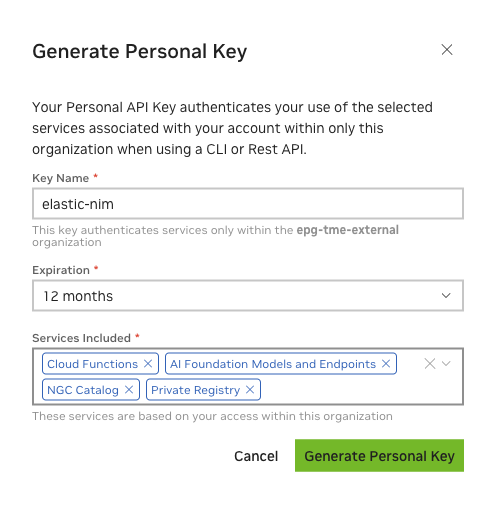
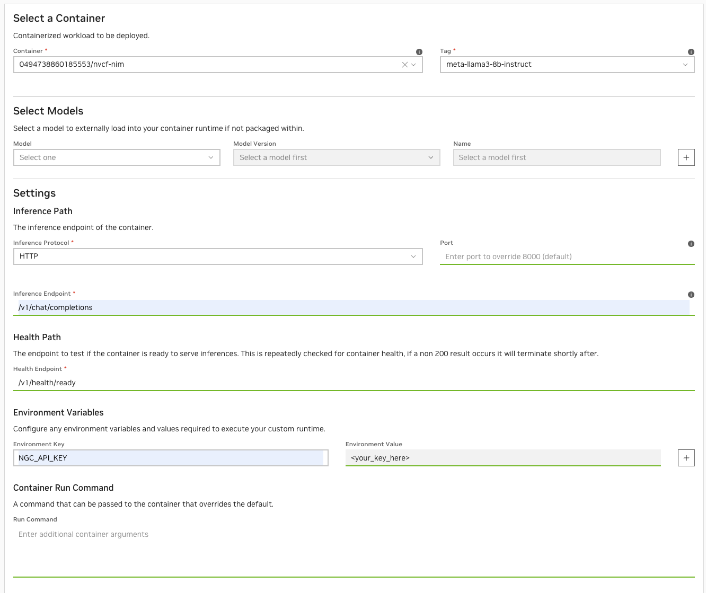
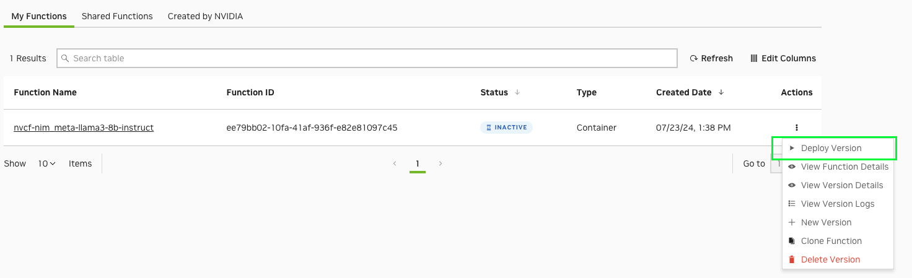
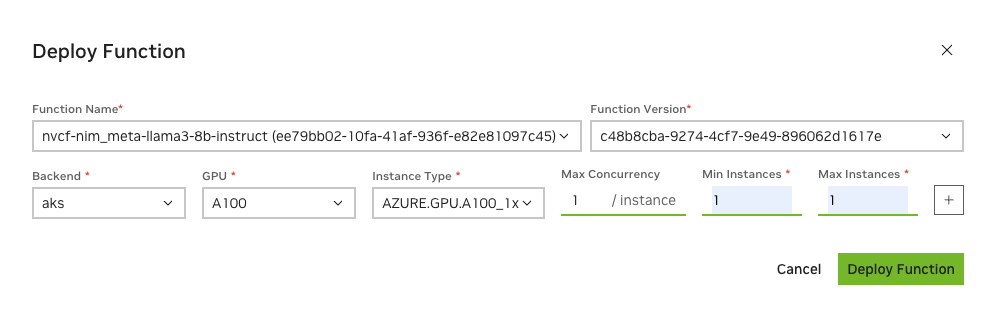
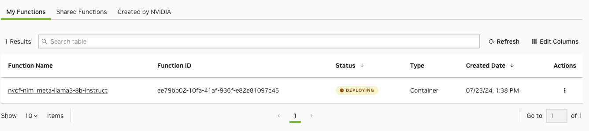

Hello World

# Elastic NIM [](\#elastic-nim "Permalink to this headline")

NVIDIA Elastic NIM is a managed AI inference service fabric enabling enterprises to seamlessly deploy and scale private Generative AI model endpoints securely on distributed accelerated cloud or data center infrastructure. Orchestrated and managed by NVIDIA, proprietary data never leaves the secure tenancy of enterprise hybrid virtual private clouds (VPCs).

NVIDIA Elastic NIM inference services for Llama 3.x are now available for enterprises to securely scale across any accelerated computing infrastructure. This guide gives a step-by-step guide for creating and deploying the llama3-8b-instruct NIM as a function on NVIDIA Cloud Functions (NVCF).

## About NIM [](\#about-nim "Permalink to this headline")

NVIDIA NIM is a set of easy-to-use microservices designed to accelerate the deployment of foundation models for generative AI applications across various computing environments. Enterprises have two options when deploying NVIDIA NIM in production - they can subscribe to the Elastic NIM service deployed and managed by NVIDIA, in their virtual private cloud or DGX Cloud or export, deploy and self-manage a NIM themselves.

Leveraging NVIDIA NIMs, and the NVIDIA Elastic NIM service ensures optimized performance at scale and the reliability of a managed service, along with data privacy and proximity. Key enterprise features and benefits include:

- Deployed in the customer VPC, NVIDIA Elastic NIM enables enterprises to comply with corporate governance and maintain the security of proprietary data.

- Ensures NVIDIA optimized performance on any accelerated infrastructure and is based on NVIDIA’s best practices for data center scale control plane and cluster management.

- Unified orchestration across hybrid clouds ensures high availability and utilization across distributed accelerated compute clusters.

- Ongoing network performance optimization for full-stack acceleration

- Burst to DGX Cloud on-demand

- NVIDIA Enterprise Support and service level agreements for production AI workflows.


## Prerequisites [](\#prerequisites "Permalink to this headline")

### Setup [](\#setup "Permalink to this headline")

- Access to a Kubernetes cluster with available GPU nodes.


> - Register Kubernetes cluster with NVCF using the NVIDIA Cluster Agent and configure cluster.
>
>
> Important
>
> Please refer to the [Cluster Setup & Management](cluster-management.html#cluster-setup-management) for additional prerequisites and step-by-step instructions.

- Access to a client Workstation or Server.


> - Install Docker or Podman client
>
> - Install Kubernetes client (kubectl) with access to the backend Kubernetes API
>
> - Ensure the client workstation/server can download files from NVIDIA NGC.

- NVIDIA NGC Account with access to the [Enterprise Catalog](https://www.nvidia.com/en-us/data-center/products/ai-enterprise/) and a private registry.


Note

Please refer to the [NGC Private Registry User Guide](https://docs.nvidia.com/ngc/gpu-cloud/ngc-private-registry-user-guide/index.html#) for more details. The private registry will be used in a later step for storing llama3-8b-instruct NIM.

## NGC Authentication [](\#ngc-authentication "Permalink to this headline")

Important

An NGC Pesronal API Key is required to access NGC resources and a key can be generated [here](https://org.ngc.nvidia.com/setup/personal-keys).

Create a NGC Personal API Key and ensure that the following is selected from the “Services Included” dropdown:

- Cloud Functions

- AI Foundation Models and Endpoints

- NGC Catalog

- Private Registry




Note

Personal keys allow you to configure an expiration date, revoke or delete the key using an action button, and rotate the key as needed. For more information about key types, please refer to the [NGC User Guide](https://docs.nvidia.com/ngc/gpu-cloud/ngc-user-guide/index.html#ngc-api-keys).

Warning

Keep your key secret and in a safe place. Do not share it or store it in a place where others can see or copy it.

## Download the NIM [](\#download-the-nim "Permalink to this headline")

Execute the following on the client workstation/server to download the llama3-8b-instruct NIM from the public registry in NGC.

### Export the NGC API Key [](\#export-the-ngc-api-key "Permalink to this headline")

Pass the value of the API Key to the docker run command as the `API_KEY` environment variable:

```
#NGC Organization ID. The name of the org, not the display name
export ORG_NAME=<org_name>

#NGC Personal API Key. Starts with nvapi-
export API_KEY=<your_key_here>
```

### NGC CLI Tool [](\#ngc-cli-tool "Permalink to this headline")

This documentation uses the NGC CLI tool in a few of the steps. See the [NGC CLI documentation](https://docs.ngc.nvidia.com/cli/index.html) for information on downloading and configuring the tool.

### Docker Login to NGC [](\#docker-login-to-ngc "Permalink to this headline")

To pull the NIM container image from NGC, first authenticate with the NVIDIA Container Registry with the following command:

```
# with docker
$ docker login nvcr.io
Username: $oauthtoken
Password: $API_KEY

#with podman
$ podman login nvcr.io
Username: $oauthtoken
Password: $API_KEY
```

Note

Use `$oauthtoken` as the username and `API_KEY` as the password. The `$oauthtoken` username is a special name that indicates that you will authenticate with an API key and not a username and password.

### List Available NIMs [](\#list-available-nims "Permalink to this headline")

NVIDIA regularly publishes new models that are available as downloadable NIMs to NVIDIA AI Enterprise customers.

Note

Use the [NGC cli](https://docs.ngc.nvidia.com/cli/cmd.html) to see a list of available NIMs.

- Use the following command to list the available NIMs, in CSV format.


> ```
> ngc registry image list --format_type csv nvcr.io/nim/meta/\*
> ```
>
> This should produce something like the following.
>
> ```
> Name,Repository,Latest Tag,Image Size,Updated Date,Permission,Signed Tag?,Access Type,Associated Products
> Llama3-70b-instruct,nim/meta/llama3-70b-instruct,1.0.0,5.96 GB,"Jun 01, 2024",unlocked,True,LISTED,"nv-ai-enterprise, nvidia-nim-da"
> Llama3-8b-instruct,nim/meta/llama3-8b-instruct,1.0.0,5.96 GB,"Jun 01, 2024",unlocked,True,LISTED,"nv-ai-enterprise, nvidia-nim-da"
> ```
>
> Note
>
> You will use the **Repository** and **Latest Tag** fields when you call the docker run command, in an upcoming step.
>
> Note
>
> Once the NIM has been downloaded, you will upload it to the NGC private registry.

- Download the NIM container image using either docker or podman.


> ```
> # with docker
> docker pull nvcr.io/nim/meta/llama3-8b-instruct:1.0.0
> # with podman
> podman pull nvcr.io/nim/meta/llama3-8b-instruct:1.0.0
> ```


Note

If you would like to customize the NIM image prior to uploading to the private registry, create a Dockerfile using NIM as the base image. See the [example](https://github.com/NVIDIA/nim-deploy/tree/main/cloud-service-providers/nvidia/nvcf) in the nim-deploy repository as a reference.

## Upload NIM to Private Registry [](\#upload-nim-to-private-registry "Permalink to this headline")

NVCF requires the NIM container image to exist in the private registry prior to creating the function.

- Tag the image with the NGC Org name that has NVCF enabled and name the image to nvcf-nim with the tag meta-llama3-8b-instruct.


> ```
> #with docker
> docker tag nvcr.io/nim/meta/llama3-8b-instruct:1.0.0 nvcr.io/$ORG_NAME/nvcf-nim:meta-llama3-8b-instruct
> #with podman
> podman tag nvcr.io/nim/meta/llama3-8b-instruct:1.0.0 nvcr.io/$ORG_NAME/nvcf-nim:meta-llama3-8b-instruct
> ```

- Push the image to Private Registry


> ```
> # with docker
> docker push nvcr.io/$ORG_NAME/nvcf-nim:meta-llama3-8b-instruct
>
> #with podman
> podman push nvcr.io/$ORG_NAME/nvcf-nim:meta-llama3-8b-instruct
> ```


## Create the Function [](\#create-the-function "Permalink to this headline")

Now that the llama3-8b-instruct NIM has been downloaded and uploaded to the private registry, next, we will add the NVCF function logic and dependencies.

- In the NGC NVCF console, create a function from a custom container


> - Function name: nvcf-nim\_meta-llama3-8b-instruct
>
>
> > 

- Define the following settings for the function:


> - Container: Choose the image from the drop-down
>
> - Tag: Choose from the available tags in the drop-down
>
> - Models: leave blank
>
> - Inference Protocol: `HTTP`
>
> - Inference Endpoint: `/v1/chat/completions`
>
> - Health Path: `/v1/health/ready`
>
> - Environment Key: `NGC_API_KEY`
>
> - Environment Value: Enter the value of your NGC Personal API Key. `$API_KEY`
>
>
> Note
>
> NIM will download the llama3-8b-instruct model from NGC during startup to the container’s ephemeral disk.
>
> 

- Click Create Function

- Deploy the Function to a backend cluster by clicking Deploy Version


> 

- Within the Deploy Function dialog, fill in the following required fields:


> - Function Name: prepopulated function name
>
> - Function Version: prepopulated latest function version
>
> - Backend: A collection of one or more (though usually one) clusters to deploy on, for example - a CSP such as Azure, OCI, GCP or an NVIDIA-specific cluster like GFN.
>
> - GPU: prepopulated GPU model
>
> - Instance Type: Each GPU type can support one or more instance types, which are different configurations, such as the number of CPU cores, and the number of GPUs per node.
>
> - Max Concurrency: The number of simultaneous invocations your container can handle at any given time
>
> - Min Instances: The minimum number of instances your function should be deployed on
>
> - Max Instances: The maximum number of instances your function is allowed to autoscale to
>
>
> 

- Click Deploy Function.


> The following dialog will be displayed. The Function will change states from Deploying to Active.
>
> 

- Set the Function ID as an environment variable for convenience. This will be used for validating/testing the function.


> ```
> $ export FUNCTION_ID=<your_function_id>
> $ curl -X POST "https://api.nvcf.nvidia.com/v2/nvcf/pexec/functions/${FUNCTION_ID}" \
> -H "Authorization: Bearer ${API_KEY}" \
> -H "Accept: application/json" \
> -H "Content-Type: application/json" \
> -d '{
>         "model": "meta/llama3-8b-instruct",
>         "messages": [
>             {
>                 "role":"user",
>                 "content":"Can you write me a happysong?"
>             }
>         ],
>         "max_tokens": 32
>     }'
>
> #output
> {"id":"cmpl-3ae8dd639f74451e98c2a2e2873441ec","object":"chat.completion","created":1721774173,"model":"meta/llama3-8b-instruct","choices":[{"index":0,"message":{"role":"assistant","content":"I'd be delighted to write a happy song for you!\n\nHere's a brand new, original song, just for you:\n\n**Title:** \"Sparkle in"},"logprobs":null,"finish_reason":"length","stop_reason":null}],"usage":{"prompt_tokens":19,"total_tokens":51,"completion_tokens":32}}%
> ```


## Validating the Function Deployment [](\#validating-the-function-deployment "Permalink to this headline")

NVCF creates a pod for the function in the \`nvcf-backend\` namespace. The pod might take a few minutes to initialize depending on the size of the image and environment factors.

```
$ kubectl get all -n nvcf-backend
NAME                                            READY   STATUS    RESTARTS   AGE
pod/0-sr-60f3f280-10a3-42bd-945a-97dd9fc1e67e   2/2     Running   0          10m
```

During initialization, pod logs are unavailable. Monitor the event log for status

```
$ kubectl get events -n nvcf-backend
LAST SEEN   TYPE     REASON                 OBJECT                                                MESSAGE
12m         Normal   Scheduled              pod/0-sr-60f3f280-10a3-42bd-945a-97dd9fc1e67e         Successfully assigned nvcf-backend/0-sr-60f3f280-10a3-42bd-945a-97dd9fc1e67e to aks-ncvfgpu-13288136-vmss000000
12m         Normal   Pulled                 pod/0-sr-60f3f280-10a3-42bd-945a-97dd9fc1e67e         Container image "nvcr.io/qtfpt1h0bieu/nvcf-core/nvcf_worker_init:0.24.10" already present on machine
12m         Normal   Created                pod/0-sr-60f3f280-10a3-42bd-945a-97dd9fc1e67e         Created container init
12m         Normal   Started                pod/0-sr-60f3f280-10a3-42bd-945a-97dd9fc1e67e         Started container init
12m         Normal   Pulled                 pod/0-sr-60f3f280-10a3-42bd-945a-97dd9fc1e67e         Container image "nvcr.io/0494738860185553/nvcf-nim:meta-llama3-8b-instruct" already present on machine
12m         Normal   Created                pod/0-sr-60f3f280-10a3-42bd-945a-97dd9fc1e67e         Created container inference
12m         Normal   Started                pod/0-sr-60f3f280-10a3-42bd-945a-97dd9fc1e67e         Started container inference
12m         Normal   Pulled                 pod/0-sr-60f3f280-10a3-42bd-945a-97dd9fc1e67e         Container image "nvcr.io/qtfpt1h0bieu/nvcf-core/nvcf_worker_utils:2.24.2" already present on machine
12m         Normal   Created                pod/0-sr-60f3f280-10a3-42bd-945a-97dd9fc1e67e         Created container utils
12m         Normal   Started                pod/0-sr-60f3f280-10a3-42bd-945a-97dd9fc1e67e         Started container utils
25m         Normal   Killing                pod/0-sr-dca52008-f0ae-43ca-9f5a-ff9c4ca8c00d         Stopping container inference
25m         Normal   Killing                pod/0-sr-dca52008-f0ae-43ca-9f5a-ff9c4ca8c00d         Stopping container utils
12m         Normal   InstanceStatusUpdate   spotrequest/sr-60f3f280-10a3-42bd-945a-97dd9fc1e67e   Request accepted for processing
12m         Normal   InstanceCreation       spotrequest/sr-60f3f280-10a3-42bd-945a-97dd9fc1e67e   Creating 1 requested instances
12m         Normal   InstanceCreation       spotrequest/sr-60f3f280-10a3-42bd-945a-97dd9fc1e67e   Created Pod Instance 0-sr-60f3f280-10a3-42bd-945a-97dd9fc1e67e
12m         Normal   InstanceStatusUpdate   spotrequest/sr-60f3f280-10a3-42bd-945a-97dd9fc1e67e   0-sr-60f3f280-10a3-42bd-945a-97dd9fc1e67e is running
25m         Normal   InstanceTermination    spotrequest/sr-d4c0d756-1a30-41bd-afdb-b8f440ac5ce4   Stopped instance nvcf-backend/0-sr-dca52008-f0ae-43ca-9f5a-ff9c4ca8c00d
25m         Normal   InstanceStatusUpdate   spotrequest/sr-d4c0d756-1a30-41bd-afdb-b8f440ac5ce4   0-sr-dca52008-f0ae-43ca-9f5a-ff9c4ca8c00d is terminated
23m         Normal   InstanceTermination    spotrequest/sr-d4c0d756-1a30-41bd-afdb-b8f440ac5ce4   All instances terminated, request will be cleaned-up
23m         Normal   InstanceStatusUpdate   spotrequest/sr-dca52008-f0ae-43ca-9f5a-ff9c4ca8c00d   0-sr-dca52008-f0ae-43ca-9f5a-ff9c4ca8c00d is terminated
23m         Normal   InstanceTermination    spotrequest/sr-dca52008-f0ae-43ca-9f5a-ff9c4ca8c00d   All instances terminated, request will be cleaned-up
```

Once running, NIM will download the model during startup if it’s not present on the disk. For large models, this can take several minutes.

Example startup logs for llama3-8b-instruct

```
$ kubectl logs 0-sr-60f3f280-10a3-42bd-945a-97dd9fc1e67e -n nvcf-backend
Defaulted container "inference" out of: inference, utils, init (init)
===========================================
== NVIDIA Inference Microservice LLM NIM ==
===========================================
NVIDIA Inference Microservice LLM NIM Version 1.0.0
Model: nim/meta/llama3-8b-instruct
Container image Copyright (c) 2016-2024, NVIDIA CORPORATION & AFFILIATES. All rights reserved.
This NIM container is governed by the NVIDIA AI Product Agreement here:
https://www.nvidia.com/en-us/data-center/products/nvidia-ai-enterprise/eula/.
A copy of this license can be found under /opt/nim/LICENSE.
The use of this model is governed by the AI Foundation Models Community License
here: https://docs.nvidia.com/ai-foundation-models-community-license.pdf.
ADDITIONAL INFORMATION: Meta Llama 3 Community License, Built with Meta Llama 3.
A copy of the Llama 3 license can be found under /opt/nim/MODEL_LICENSE.
2024-07-23 22:27:23,428 [INFO] PyTorch version 2.2.2 available.
2024-07-23 22:27:24,016 [WARNING] [TRT-LLM] [W] Logger level already set from environment. Discard new verbosity: error
2024-07-23 22:27:24,016 [INFO] [TRT-LLM] [I] Starting TensorRT-LLM init.
2024-07-23 22:27:24,202 [INFO] [TRT-LLM] [I] TensorRT-LLM inited.
[TensorRT-LLM] TensorRT-LLM version: 0.10.1.dev2024053000
INFO 07-23 22:27:24.927 api_server.py:489] NIM LLM API version 1.0.0
INFO 07-23 22:27:24.929 ngc_profile.py:217] Running NIM without LoRA. Only looking for compatible profiles that do not support LoRA.
INFO 07-23 22:27:24.929 ngc_profile.py:219] Detected 1 compatible profile(s).
INFO 07-23 22:27:24.929 ngc_injector.py:106] Valid profile: 8835c31752fbc67ef658b20a9f78e056914fdef0660206d82f252d62fd96064d (vllm-fp16-tp1) on GPUs [0]
INFO 07-23 22:27:24.929 ngc_injector.py:141] Selected profile: 8835c31752fbc67ef658b20a9f78e056914fdef0660206d82f252d62fd96064d (vllm-fp16-tp1)
INFO 07-23 22:27:25.388 ngc_injector.py:146] Profile metadata: llm_engine: vllm
INFO 07-23 22:27:25.388 ngc_injector.py:146] Profile metadata: precision: fp16
INFO 07-23 22:27:25.388 ngc_injector.py:146] Profile metadata: feat_lora: false
INFO 07-23 22:27:25.388 ngc_injector.py:146] Profile metadata: tp: 1
INFO 07-23 22:27:25.389 ngc_injector.py:166] Preparing model workspace. This step might download additional files to run the model.
INFO 07-23 22:28:14.764 ngc_injector.py:172] Model workspace is now ready. It took 49.375 seconds
INFO 07-23 22:28:14.767 llm_engine.py:98] Initializing an LLM engine (v0.4.1) with config: model='/tmp/meta--llama3-8b-instruct-k3_wpocb', speculative_config=None, tokenizer='/tmp/meta--llama3-8b-instruct-k3_wpocb', skip_tokenizer_init=False, tokenizer_mode=auto, revision=None, tokenizer_revision=None, trust_remote_code=False, dtype=torch.bfloat16, max_seq_len=8192, download_dir=None, load_format=auto, tensor_parallel_size=1, disable_custom_all_reduce=False, quantization=None, enforce_eager=False, kv_cache_dtype=auto, quantization_param_path=None, device_config=cuda, decoding_config=DecodingConfig(guided_decoding_backend='outlines'), seed=0)
WARNING 07-23 22:28:15.0 logging.py:314] Special tokens have been added in the vocabulary, make sure the associated word embeddings are fine-tuned or trained.
INFO 07-23 22:28:15.16 utils.py:609] Found nccl from library /usr/local/lib/python3.10/dist-packages/nvidia/nccl/lib/libnccl.so.2
INFO 07-23 22:28:16 selector.py:28] Using FlashAttention backend.
INFO 07-23 22:28:19 model_runner.py:173] Loading model weights took 14.9595 GB
INFO 07-23 22:28:20.644 gpu_executor.py:119] # GPU blocks: 27793, # CPU blocks: 2048
INFO 07-23 22:28:22 model_runner.py:973] Capturing the model for CUDA graphs. This may lead to unexpected consequences if the model is not static. To run the model in eager mode, set 'enforce_eager=True' or use '--enforce-eager' in the CLI.
INFO 07-23 22:28:22 model_runner.py:977] CUDA graphs can take additional 1~3 GiB memory per GPU. If you are running out of memory, consider decreasing `gpu_memory_utilization` or enforcing eager mode. You can also reduce the `max_num_seqs` as needed to decrease memory usage.
INFO 07-23 22:28:27 model_runner.py:1054] Graph capturing finished in 5 secs.
WARNING 07-23 22:28:28.194 logging.py:314] Special tokens have been added in the vocabulary, make sure the associated word embeddings are fine-tuned or trained.
INFO 07-23 22:28:28.205 serving_chat.py:347] Using default chat template:
{{ content }}{{ '<|start_header_id|>assistant<|end_header_id|>
' }}
WARNING 07-23 22:28:28.420 logging.py:314] Special tokens have been added in the vocabulary, make sure the associated word embeddings are fine-tuned or trained.
INFO 07-23 22:28:28.431 api_server.py:456] Serving endpoints:
0.0.0.0:8000/openapi.json
0.0.0.0:8000/docs
0.0.0.0:8000/docs/oauth2-redirect
0.0.0.0:8000/metrics
0.0.0.0:8000/v1/health/ready
0.0.0.0:8000/v1/health/live
0.0.0.0:8000/v1/models
0.0.0.0:8000/v1/version
0.0.0.0:8000/v1/chat/completions
0.0.0.0:8000/v1/completions
INFO 07-23 22:28:28.431 api_server.py:460] An example cURL request:
curl -X 'POST' \
'http://0.0.0.0:8000/v1/chat/completions' \
-H 'accept: application/json' \
-H 'Content-Type: application/json' \
-d '{
    "model": "meta/llama3-8b-instruct",
    "messages": [
    {
        "role":"user",
        "content":"Hello! How are you?"
    },
    {
        "role":"assistant",
        "content":"Hi! I am quite well, how can I help you today?"
    },
    {
        "role":"user",
        "content":"Can you write me a song?"
    }
    ],
    "top_p": 1,
    "n": 1,
    "max_tokens": 15,
    "stream": true,
    "frequency_penalty": 1.0,
    "stop": ["hello"]
}'
INFO 07-23 22:28:28.476 server.py:82] Started server process [32]
INFO 07-23 22:28:28.477 on.py:48] Waiting for application startup.
INFO 07-23 22:28:28.478 on.py:62] Application startup complete.
INFO 07-23 22:28:28.480 server.py:214] Uvicorn running on http://0.0.0.0:8000 (Press CTRL+C to quit)
INFO 07-23 22:28:28.574 httptools_impl.py:481] 127.0.0.1:40948 - "GET /v1/health/ready HTTP/1.1" 503
INFO 07-23 22:28:29.75 httptools_impl.py:481] 127.0.0.1:40962 - "GET /v1/health/ready HTTP/1.1" 200
INFO 07-23 22:28:38.478 metrics.py:334] Avg prompt throughput: 0.3 tokens/s, Avg generation throughput: 1.5 tokens/s, Running: 0 reqs, Swapped: 0 reqs, Pending: 0 reqs, GPU KV cache usage: 0.0%, CPU KV cache usage: 0.0%
INFO 07-23 22:28:48.478 metrics.py:334] Avg prompt throughput: 0.0 tokens/s, Avg generation throughput: 0.0 tokens/s, Running: 0 reqs, Swapped: 0 reqs, Pending: 0 reqs, GPU KV cache usage: 0.0%, CPU KV cache usage: 0.0%
```

## Troubleshooting [](\#troubleshooting "Permalink to this headline")

This process can take several minutes. If too much time has passed, ensure the API Personal Key is valid and there are no issues in the event logs.

Ensure GPU-enabled pods can be scheduled in the cluster. Check that a GPU is available and no taints exist that would block the scheduler. See [troubleshooting the GPU operator for more information](https://docs.nvidia.com/datacenter/cloud-native/gpu-operator/latest/troubleshooting.html)

Ensure the NGC Personal API Key in the Authorization header is correct and has appropriate access. See [Statuses and Errors](api.html#invocation-errors) for more tips.


