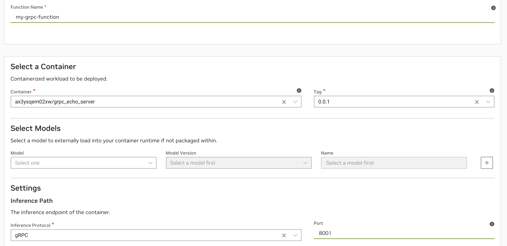

Hello World


Note

It’s recommended that the API Key that you generate includes both **Cloud Functions and Private Registry scopes** to enable ideal Cloud Functions workflows.

### Download & Configure the NGC CLI [](\#download-configure-the-ngc-cli "Permalink to this headline")

1. Navigate to the [NGC CLI Installer Page](https://ngc.nvidia.com/setup/installers/cli) to download the CLI and follow the installation instructions for your platform.

2. Find your NGC organization name within the [NGC Organization Profile Page](https://org.ngc.nvidia.com/profile). This is _not_ the Display Name. For example: `qdrlnbkss123`.

3. Run `ngc config set` and input the Personal API Key generated in the previous step, along with your organization name. If prompted, default to `no-team` and `no-ace`.


```
1> ngc config set
2Enter API key [****bi9Z]. Choices: [<VALID_APIKEY>, 'no-apikey']: $API_KEY
3Enter CLI output format type [json]. Choices: ['ascii', 'csv', 'json']: json
4Enter org [ax3ysqem02xw]. Choices: ['$ORG_NAME']: $ORG_NAME
5Enter team [no-team]. Choices: ['no-team']:
6Enter ace [no-ace]. Choices: ['no-ace']:
```

### Authenticate with NGC Docker Registry [](\#authenticate-with-ngc-docker-registry "Permalink to this headline")

1. Run `docker login nvcr.io` and input the following, note `$oauthtoken` is the actual string to input, and `$API_KEY` is the Personal API key generated in the first step.


```
1> docker login nvcr.io
2Username: $oauthtoken
3Password: $API_KEY
```

### (Optional) Push a Container to the NGC Private Registry [](\#optional-push-a-container-to-the-ngc-private-registry "Permalink to this headline")

You should now be able to push a container to the NGC Private Registry. Optionally, validate this by pushing an example container from the [samples repository](https://github.com/NVIDIA/nv-cloud-function-helpers/tree/main/examples):

1. First clone and build the docker image.


```
1> git clone https://github.com/NVIDIA/nv-cloud-function-helpers.git
2> cd nv-cloud-function-helpers/examples/fastapi_echo_sample
3> docker build . -t fastapi_echo_sample
```

1. Now tag and push the docker image to the NGC Private Registry.


```
1> docker tag fastapi_echo_sample:latest nvcr.io/$ORG_NAME/fastapi_echo_sample:latest
2> docker push nvcr.io/$ORG_NAME/fastapi_echo_sample:latest
```

Warning

Note that any additional slashes in the path when tagging and pushing to `nvcr.io` will be detected by Private Registry as specifying a team. This is most likely not what you want.

1. Once this finishes, you’ll now be able to see the new container in the [NGC Private Registry Containers Page](https://registry.ngc.nvidia.com/containers) and it will be available for use in function creation.


### Best Practices with NGC Docker Registry and Cloud Functions [](\#best-practices-with-ngc-docker-registry-and-cloud-functions "Permalink to this headline")

#### Container Versioning [](\#container-versioning "Permalink to this headline")

- Ensure that any resources that you tag for deployment into production environments are not simply using “latest” and are following a standard version control convention.


> - During autoscaling, a function scaling any additional instances will pull the same specificed container image and version. If version is set to “latest”, and the “latest” container image is updated between instance scaling, this can lead to undefined behavior.

- Function versions created are immutable, this means that the container image and version cannot be updated for a function without creating a new version of the function.


#### Usage of NGC Teams [](\#usage-of-ngc-teams "Permalink to this headline")

- For easier handling of authorization and accessibility, we recommend pushing your containers, helm charts, models and resources to the root of your NGC organization (i.e. “No Team”), not to a team within the organization.

- Note that any additional slashes in the path when tagging and pushing to `nvcr.io` will be detected as an NGC team.


## Container-Based Function Creation [](\#container-based-function-creation "Permalink to this headline")

Container-based functions require building and pushing a Cloud Functions compatible [Docker](https://docker.com) container image to the NGC Private Registry.

Attention

Before proceeding, ensure that you have the NGC CLI installed and configured with an API Key that has the required scopes for Cloud Functions and Private Registry.

### Resources [](\#resources "Permalink to this headline")

- Example containers can be found [here](https://github.com/NVIDIA/nv-cloud-function-helpers/tree/main/examples).

- The repository also contains [helper functions](https://github.com/NVIDIA/nv-cloud-function-helpers/blob/main/nv_cloud_function_helpers/nvcf_container/helpers.py) that are useful when authoring your container, including:


> - Helpers that parse Cloud Functions-specific parameters on invocation
>
> - Helpers that can be used to instrument your container with Cloud Functions compatible logs
>
> - Helpers for working with assets

- After container creation, but before proceeding to deployment, it is **strongly recommended** to validate your container’s configuration locally, see [Deployment Validation](function-deployment.html#validate-deployment).

- It’s always a **best practice to emit logs** from your inference container. See [Logging and Metrics](function-monitoring.html#logging-metrics) for how to add logs to your container. Cloud Functions also supports third-party logging and metrics emission from your container.


### Container Endpoints [](\#container-endpoints "Permalink to this headline")

Any server can be implemented within the container, as long as it implements the following:

- For HTTP-based functions, a health check endpoint that returns a 200 HTTP Status Code on success.

- For gRPC-based functions, a standard gRPC health check. See [these docs for more info](https://github.com/grpc/grpc-proto/blob/master/grpc/health/v1/health.proto) also [gRPC Health Checking](https://grpc.io/docs/guides/health-checking/).

- An inference endpoint (this endpoint will be called during function invocation)


These endpoints are expected to be served on the same port, defined as the `inferencePort`.

Warning

Cloud Functions reserves the following ports on your container for internal monitoring and metrics:

- Port `8080`

- Port `8010`


Cloud Functions also expects the following directories in the container to remain read-only for caching purposes:

- `/config/` directory

- Nested directories created inside `/config/`


### Composing a FastAPI Container [](\#composing-a-fastapi-container "Permalink to this headline")

It’s possible to use any container with Cloud Functions as long as it implements a server with the above endpoints. The below is an example of a FastAPI-based container compatible with Cloud Functions. Clone the [full example here](https://github.com/NVIDIA/nv-cloud-function-helpers/tree/main/examples/fastapi_echo_sample).

#### Implement the Server [](\#implement-the-server "Permalink to this headline")

http\_echo\_server.py [](#id12 "Permalink to this code")

```
 1import os
 2import time
 3import uvicorn
 4from pydantic import BaseModel
 5from fastapi import FastAPI, status
 6from fastapi.responses import StreamingResponse
 7
 8
 9app = FastAPI()
10
11class HealthCheck(BaseModel):
12    status: str = "OK"
13
14# Implement the health check endpoint
15@app.get("/health", tags=["healthcheck"], summary="Perform a Health Check", response_description="Return HTTP Status Code 200 (OK)", status_code=status.HTTP_200_OK, response_model=HealthCheck)
16def get_health() -> HealthCheck:
17    return HealthCheck(status="OK")
18
19class Echo(BaseModel):
20    message: str
21    delay: float = 0.000001
22    repeats: int = 1
23    stream: bool = False
24
25
26# Implement the inference endpoint
27@app.post("/echo")
28async def echo(echo: Echo):
29    if echo.stream:
30        def stream_text():
31            for _ in range(echo.repeats):
32                time.sleep(echo.delay)
33                yield f"data: {echo.message}\n\n"
34        return StreamingResponse(stream_text(), media_type="text/event-stream")
35    else:
36        time.sleep(echo.delay)
37        return echo.message*echo.repeats
38
39# Serve the endpoints on a port
40if __name__ == "__main__":
41    uvicorn.run(app, host="0.0.0.0", port=8000, workers=int(os.getenv('WORKER_COUNT', 500)))
```

Note in the example above, the function’s configuration during creation will be:

- Inference Protocol: HTTP

- Inference Endpoint: `/echo`

- Health Endpoint: `/health`

- Inference Port (also used for health check): `8000`


#### Create the Dockerfile [](\#create-the-dockerfile "Permalink to this headline")

Dockerfile [](#id13 "Permalink to this code")

```
 1FROM python:3.10.13-bookworm
 2
 3ENV WORKER_COUNT=10
 4
 5WORKDIR /app
 6
 7COPY requirements.txt ./
 8
 9RUN python -m pip install --no-cache-dir -U pip && \
10    python -m pip install --no-cache-dir -r requirements.txt
11
12COPY http_echo_server.py /app/
13
14CMD uvicorn http_echo_server:app --host=0.0.0.0 --workers=$WORKER_COUNT
```

#### Build the Container & Create the Function [](\#build-the-container-create-the-function "Permalink to this headline")

See the [Quickstart](quickstart.html#quick-start) for the remaining steps.

### Composing a PyTriton Container [](\#composing-a-pytriton-container "Permalink to this headline")

NVIDIA’s [PyTriton](https://triton-inference-server.github.io/pytriton/) is a Python native solution of Triton inference server. A minimum version of 0.3.0 is required.

#### Create the “requirements.txt” File [](\#id5 "Permalink to this headline")

- This file should list the Python dependencies required for your model.

- Add nvidia-pytriton to your `requirements.txt` file.


Here is an example of a `requirements.txt` file:

requirements.txt [](#id14 "Permalink to this code")

```
1--extra-index-url https://pypi.ngc.nvidia.com
2opencv-python-headless
3pycocotools
4matplotlib
5torch==2.1.0
6nvidia-pytriton==0.3.0
7numpy
```

#### Create the “run.py” File [](\#create-the-run-py-file "Permalink to this headline")

1. Your `run.py` file (or similar Python file) needs to define a PyTriton model.

2. This involves importing your model dependencies, creating a PyTritonServer class with an `__init__` function, an `_infer_fn` function and a `run` function that serves the inference\_function, defining the model name, the inputs and the outputs along with optional configuration.


Here is an example of a `run.py` file:

run.py [](#id15 "Permalink to this code")

```
 1import numpy as np
 2from pytriton.model_config import ModelConfig, Tensor
 3from pytriton.triton import Triton, TritonConfig
 4import time
 5....
 6class PyTritonServer:
 7    """triton server for timed_sleeper"""
 8
 9    def __init__(self):
10        # basically need to accept image, mask(PIL Images), prompt, negative_prompt(str), seed(int)
11        self.model_name = "timed_sleeper"
12
13    def _infer_fn(self, requests):
14        responses = []
15        for req in requests:
16            req_data = req.data
17            sleep_duration = numpy_array_to_variable(req_data.get("sleep_duration"))
18            # deal with header dict keys being lowerscale
19            request_parameters_dict = uppercase_keys(req.parameters)
20            time.sleep(sleep_duration)
21            responses.append({"sleep_duration": np.array([sleep_duration])})
22
23        return responses
24
25    def run(self):
26        """run triton server"""
27        with Triton(
28            config=TritonConfig(
29                http_header_forward_pattern="NVCF-*",  # this is required
30                http_port=8000,
31                grpc_port=8001,
32                metrics_port=8002,
33            )
34        ) as triton:
35            triton.bind(
36                model_name="timed_sleeper",
37                infer_func=self._infer_fn,
38                inputs=[
39                    Tensor(name="sleep_duration", dtype=np.uint32, shape=(1,)),
40                ],
41                outputs=[Tensor(name="sleep_duration", dtype=np.uint32, shape=(1,))],
42                config=ModelConfig(batching=False),
43            )
44            triton.serve()
45if __name__ == "__main__":
46    server = PyTritonServer()
47    server.run()
```

#### Create the “Dockerfile” [](\#id6 "Permalink to this headline")

1. Create a file named `Dockerfile` in your model directory.

2. It’s **strongly recommended to use NVIDIA-optimized containers like CUDA, Pytorch or TensorRT as your base container**. They can be downloaded from the [NGC Catalog](https://catalog.ngc.nvidia.com/).

3. Make sure to install your Python requirements in your `Dockerfile`.

4. Copy in your model source code, and model weights unless you plan to host them in NGC Private Registry.


Here is an example of a `Dockerfile`:

Dockerfile [](#id16 "Permalink to this code")

```
 1FROM nvcr.io/nvidia/cuda:12.1.1-devel-ubuntu22.04
 2RUN apt-get update && apt-get install -y \
 3    git \
 4    python3 \
 5    python3-pip \
 6    python-is-python3 \
 7    libsm6 \
 8    libxext6 \
 9    libxrender-dev \
10    curl \
11    && rm -rf /var/lib/apt/lists/*
12WORKDIR /workspace/
13
14# Install requirements file
15COPY requirements.txt requirements.txt
16RUN pip install --no-cache-dir --upgrade pip
17RUN pip install --no-cache-dir -r requirements.txt
18ENV DEBIAN_FRONTEND=noninteractive
19
20# Copy model source code and weights
21COPY model_weights /models
22COPY model_source .
23COPY run.py .
24
25# Set run command to start PyTriton to serve the model
26CMD python3 run.py
```

#### Build the Docker Image [](\#build-the-docker-image "Permalink to this headline")

1. Open a terminal or command prompt.

2. Navigate to the `my_model` directory.

3. Run the following command to build the docker image:


```
docker build -t my_model_image .
```

Replace `my_model_image` with the desired name for your docker image.

1. Tag and push the docker image to the NGC Private Registry.


```
1> docker tag my_model_image:latest nvcr.io/$ORG_NAME/my_model_image:latest
2> docker push nvcr.io/$ORG_NAME/my_model_image:latest
```

#### Create the Function [](\#create-the-function "Permalink to this headline")

1. Create the function via API by running the following curl with an `$API_KEY` and your `$ORG_NAME`. In this example, we defined the inference endpoint as `8000` and are using the default inference and health endpoint paths.


```
 1 curl --location 'https://api.ngc.nvidia.com/v2/nvcf/functions' \
 2 --header 'Content-Type: application/json' \
 3 --header 'Accept: application/json' \
 4 --header 'Authorization: Bearer $API_KEY' \
 5 --data '{
 6     "name": "my-model-function",
 7     "inferenceUrl": "/v2/models/my_model_image/infer",
 8     "healthUri": "/v2/health/ready",
 9     "inferencePort": 8000,
10     "containerImage": "nvcr.io/$ORG_NAME/my_model_image:latest"
11 }'
```

### Triton-based Container Configuration [](\#triton-based-container-configuration "Permalink to this headline")

NVIDIA Cloud Functions is designed to work natively with [Triton Inference Server](https://developer.nvidia.com/triton-inference-server) based containers, including leveraging metrics and health checks from the server.

Pre-built Triton docker images can be found within [NGC’s Container catalog](https://catalog.ngc.nvidia.com/orgs/nvidia/containers/tritonserver). A minimum version of 23.04 (2.33.0) is required.

#### Configuration [](\#configuration "Permalink to this headline")

The default health `/v2/health/ready`, port `8000`, and inference endpoint ( `v2/models/$MODEL_NAME/infer`) work automatically with Triton-based containers.

Note

The docker image’s run command _must_ be configured with the following:

```
CMD tritonserver --model-repository=${MODEL_PATH} --http-header-forward-pattern NVCF-.*
```

Here is an example of a `Dockerfile`:

Dockerfile [](#id17 "Permalink to this code")

```
 1FROM nvcr.io/nvidia/tritonserver:24.01-py3
 2
 3# install requirements file
 4COPY requirements.txt requirements.txt
 5RUN pip install --no-cache-dir --upgrade pip
 6RUN pip install --no-cache-dir -r requirements.txt
 7
 8COPY model_repository /model_repository
 9
10ENV CUDA_MODULE_LOADING LAZY
11ENV LOG_VERBOSE 0
12
13CMD tritonserver --log-verbose ${LOG_VERBOSE} --http-header-forward-pattern (nvcf-.*|NVCF-.*) \
14    --model-repository /model_repository/ --model-control-mode=none --strict-readiness 1
```

### Creating Functions with NGC Models & Resources [](\#creating-functions-with-ngc-models-resources "Permalink to this headline")

When creating a function, [models](https://docs.nvidia.com/ngc/gpu-cloud/ngc-private-registry-user-guide/index.html#ngc-models) and [resources](https://docs.nvidia.com/ngc/gpu-cloud/ngc-private-registry-user-guide/index.html#ngc-resources) can be mounted to the function instance. The models will be available under `/config/models/{modelName}` and `/config/resources/{resourceName}` where `modelName` and `resourceName` are specified as part of the API request.

Here is an example where a model and resource are added to a function creation API call, for an echo sample function:

```
 1curl -X 'POST' \
 2  'https://api.ngc.nvidia.com/v2/nvcf/functions' \
 3  -H 'Authorization: Bearer $API_KEY' \
 4  -H 'accept: application/json' \
 5  -H 'Content-Type: application/json' \
 6  -d '{
 7  "name": "echo_function",
 8  "inferenceUrl": "/echo",
 9  "containerImage": "nvcr.io/$ORG_NAME/echo:latest",
10  "apiBodyFormat": "CUSTOM",
11  "models": [
12    {
13      "name": "simple_int8",
14      "version": "1",
15      "uri": "v2/org/cf/$ORG_NAME/models/simple_int8/versions/1/zip"
16    }
17  ],
18  "resources": [
19    {
20      "name": "simple_resource",
21      "version": "1",
22      "uri": "v2/org/cf/$ORG_NAME/resources/simple_resource/versions/1/zip"
23    }
24  ]
25}'
```

Within the container, once the function instance is deployed, the model would be mounted at `/config/models/simple_int8` and resource mounted at `/config/resources/simple_int8`

### Creating gRPC-based Functions [](\#creating-grpc-based-functions "Permalink to this headline")

Cloud Functions supports function invocation via gRPC. During function creation, specify that the function is a gRPC function by setting the “Inference Protocol”, or `inferenceUrl` field to `/grpc`.

#### Prerequisites [](\#prerequisites "Permalink to this headline")

- The function container must implement a gRPC port, endpoint and health check. The health check is expected to be served by the gRPC inference port, there is no need to define a separate health endpoint path.


> - See [gRPC health checking](https://grpc.io/docs/guides/health-checking/).
>
> - See an [example container](https://github.com/NVIDIA/nv-cloud-function-helpers/blob/main/examples/grpc_echo_sample/grpc_echo_server.py) with a gRPC server that is Cloud Functions compatible.


#### gRPC Function Creation via UI [](\#grpc-function-creation-via-ui "Permalink to this headline")

In the Function Creation Page, set the “Inference Protocol” to `gRPC` and port to whatever your gRPC server has implemented.



#### gRPC Function Creation via CLI [](\#grpc-function-creation-via-cli "Permalink to this headline")

When creating the gRPC function, set the `--inference-url` argument to `/grpc`:

```
1 ngc cf function create --inference-port 8001 --container-image nvcr.io/$ORG_NAME/grpc_echo_sample:latest --name my-grpc-function --inference-url /grpc
```

#### gRPC Function Creation via API [](\#grpc-function-creation-via-api "Permalink to this headline")

When creating the gRPC function, set the `inferenceURl` field to `/grpc`:

```
 1 curl --location 'https://api.ngc.nvidia.com/v2/nvcf/functions' \
 2 --header 'Content-Type: application/json' \
 3 --header 'Accept: application/json' \
 4 --header 'Authorization: Bearer $API_KEY' \
 5 --data '{
 6     "name": "my-grpc-function",
 7     "inferenceUrl": "/grpc",
 8     "inferencePort": 8001,
 9     "containerImage": "nvcr.io/$ORG_NAME/grpc_echo_sample:latest"
10 }'
```

### Available Container Variables [](\#available-container-variables "Permalink to this headline")

The following is a reference of available variables via the headers of the invocation message (auto-populated by Cloud Functions), accessible within the container.

For examples of how to extract and use some of these variables, see [NVCF Container Helper Functions](https://github.com/NVIDIA/nv-cloud-function-helpers/tree/main).

| Name | Description |
| --- | --- |
| NVCF-REQID | Request ID for this request. |
| NVCF-SUB | Message subject. |
| NVCF-NCAID | Function’s organization’s NCA ID. |
| NVCF-FUNCTION-NAME | Function name. |
| NVCF-FUNCTION-ID | Function ID. |
| NVCF-FUNCTION-VERSION-ID | Function version ID. |
| NVCF-ASSET-DIR | Asset directory path. Not available for helm deployments. |
| NVCF-LARGE-OUTPUT-DIR | Large output directory path. |
| NVCF-MAX-RESPONSE-SIZE-BYTES | Max response size in bytes for the function. |
| NVCF-NSPECTID | NVIDIA reserved variable. |
| NVCF-BACKEND | Backend or “Cluster Group” the function is deployed on. |
| NVCF-INSTANCETYPE | Instance type the function is deployed on. |
| NVCF-REGION | Region or zone the function is deployed in. |
| NVCF-ENV | Spot environment if deployed on spot instances. |

### Adding Partial Response (Progress) [](\#adding-partial-response-progress "Permalink to this headline")

Below are instructions on setting up output directories and efficiently tracking and communicating inferencing progress using Cloud Functions. **This functionality is only supported for container-based functions.**

- Cloud Functions automatically configures the output directory for you. To access the path, simply read the `NVCF-LARGE-OUTPUT-DIR` header. `NVCF-LARGE-OUTPUT-DIR` points to the directory for that particular `requestId`.

- To enable partial progress reporting, you will need to store partial and completed outputs, and create a `progress` file in the output directory.

- Once the output file and progress file are correctly set up in the output directory under the correct request id, Cloud Functions will automatically detect them.

- When using the [invocation API to poll for a response](api.html#polling), `progress` will be returned as the header `NVCF-PERCENT-COMPLETE`, along with any partial response data.


#### Storing Partial and Complete Outputs [](\#storing-partial-and-complete-outputs "Permalink to this headline")

1. When your Custom [BLS](https://docs.nvidia.com/deeplearning/triton-inference-server/user-guide/docs/python_backend/README.html#business-logic-scripting) generates large outputs, save them temporarily with the “\*.partial” extension inside the `NVCF-LARGE-OUTPUT-DIR` directory. For instance, if you’re writing an image, name it `image1.partial`.

2. Once the writing of the output file is complete, rename it from “\*.partial” to its appropriate extension. Continuing with our example, rename `image1.partial` to `image1.jpg`.


#### Creating a Progress File [](\#creating-a-progress-file "Permalink to this headline")

Cloud Functions actively observes the output directory for a file named `progress`. This file is used to communicate progress and partial responses back to the caller.

This file should contain well-formed JSON data. Structure the JSON content as follows:

```
1{
2   "id": "{requestId}",
3   "progress": 50,
4   "partialResponse": {
5      "exampleKey": "Insert any well-formed JSON here, but ensure its size is less than 250K"
6   }
7}
```

Replace `requestId` with the actual request id if it’s present. Modify the progress integer as needed, ranging from 0 (just started) to 100 (fully complete). Within `partialResponse`, insert any JSON content you want to send as a partial response, making sure it’s smaller than 250KB.

#### Best Practices [](\#best-practices "Permalink to this headline")

- Always use the “.partial” extension to avoid sending partial or incomplete data.

- Rename to the final extension only when the writing process is fully complete.

- Ensure your progress file remains under 250KB to maintain efficiency and avoid errors.


## Helm-Based Function Creation [](\#helm-based-function-creation "Permalink to this headline")

Cloud functions support helm-based functions for orchestration across multiple containers.

### Prerequisites [](\#helm-prereq "Permalink to this headline")

1. The helm chart **must have a “mini-service” container defined, which will be used as the inference entry point.**

2. The name of this service in your helm chart should be supplied by setting `helmChartServiceName` during the function definition. This allows Cloud Functions to communicate and make inference requests to the “mini-service” endpoint.


Attention

The `servicePort` defined within the helm chart should be used as the `inferencePort` supplied during function creation. Otherwise, Cloud Functions will not be able to reach the “mini-service”.

### Secret Management [](\#secret-management "Permalink to this headline")

For pulling containers defined as part of the helm chart from NGC Private Registry, a new value named `ngcImagePullSecretName` needs to be defined in the chart.The value is referred to in deployment spec as `spec.imagePullSecrets.name` of pods in the chart.

Warning

Containers defined in the helm chart should be in the same NGC Organization and Team that the helm chart itself is being pulled from.

### Create a Helm-based Function [](\#create-a-helm-based-function "Permalink to this headline")

1. Ensure your helm chart is uploaded to NGC Private Registry and adheres to the [Prerequisites](#helm-prereq) listed above.

2. Create the function:

   - Include the following additional parameters in the function definition


     > - `helmChart`
     >
     > - `helmChartServiceName`

   - The `helmChart` property should be set to the URL hosted by the NGC Model Registry pointing to the helm chart that will deploy the “mini-service”. Please note, that this helm chart URL should be accessible to the NGC org in which the function will eventually be deployed. The helm chart URL should follow the format: `https://helm.ngc.nvidia.com/$ORG_ID/$TEAM_NAME/charts/$NAME-X.Y.Z.tgz` for example, `https://helm.ngc.nvidia.com/abc123/teamA/charts/nginx-0.1.5.tgz` would be a valid chart URL but `https://helm.ngc.nvidia.com/abc123/teamA/charts/nginx-0.1.5-hello.tgz` would not.

   - The `helmChartServiceName` is used for checking if the “mini-service” is ready for inference and is also scraped for function metrics. At this time, templatized service names are not supported. **This must match the service name of your “mini-service” with the exposed entry point port.**

   - Important: The Helm chart name should not contain underscores or other special symbols, as that may cause issues during deployment.

**Example Creation via API**

Please see our [sample helm chart used](https://github.com/NVIDIA/nv-cloud-function-helpers/tree/main/examples/helmchart_echo_sample) in this example for reference.

Below is an example function creation API call creating a helm-based function:

```
 1curl -X 'POST' \
 2    'https://api.ngc.nvidia.com/v2/nvcf/functions' \
 3    -H 'Authorization: Bearer $API_KEY' \
 4    -H 'accept: application/json' \
 5    -H 'Content-Type: application/json' \
 6    -d '{
 7    "name": "function_name",
 8    "inferenceUrl": "v2/models/model_name/versions/model_version/infer",
 9    "inferencePort": 8001,
10    "helmChart": "https://helm.ngc.nvidia.com/$ORG_ID/$TEAM_NAME/charts/inference-test-1.0.tgz",
11    "helmChartServiceName": "service_name",
12    "apiBodyFormat": "CUSTOM"
13}'
```

Note

For gRPC-based functions, set `"inferenceURL" : "/gRPC"`. This signals to Cloud Functions that the function is using gRPC protocol and is not expected to have a `/gRPC` endpoint exposed for inferencing requests.

1. Proceed with function deployment and invocation normally.


- Automatic mounting of NGC Models and Resources for your container is not supported.

- For any downloads (such as of assets or models) occurring within your function’s containers, download size is limited by the disk space on the VM - for GFN this is 100GB approximately, and for other clusters this limit will vary.

- Progress/partial response reporting is not supported, including any additional artifacts generated during inferencing. Consider opting for HTTP streaming or gRPC bidirectional support.

- Supported k8s artifacts under Helm Chart Namespace are listed below. Others will be rejected:


> - Deployment
>
> - Service
>
> - ServiceAccount
>
> - Role & RoleBindings
>
> - ConfigMaps
>
> - Secrets


### Helm Chart Overrides [](\#helm-chart-overrides "Permalink to this headline")

To override keys in your helm chart `values.yml`, you can provide the `configuration` parameter and supply corresponding key-value pairs in JSON format which you would like to be overridden when the function is deployed.

Example helm chart override [](#id18 "Permalink to this code")

```
 1curl -X 'POST' \
 2 'https://api.ngc.nvidia.com/v2/nvcf/deployments/functions/fe6e6589-12bb-423a-9bf6-8b9d028b8bf4/versions/fe6e6589-12bb-423a-9bf6-8b9d028b8bf4' \
 3 -H 'Authorization: Bearer $API_KEY' \
 4 -H 'accept: application/json' \
 5 -H 'Content-Type: application/json' \
 6 -d '{
 7     "deploymentSpecifications": [{
 8         "gpu": "L40",
 9         "backend": "OCI",
10         "maxInstances": 2,
11         "minInstances": 1,
12         "configuration": {
13         "key_one": "<value>",
14         "key_two": { "key_two_subkey_one": "<value>", "key_two_subkey_two": "<value>" }
15     ...
16     },
17     {
18         "gpu": "T10",
19         "backend": "GFN",
20         "maxInstances": 2,
21         "minInstances": 1
22     }]
23 }'
```


