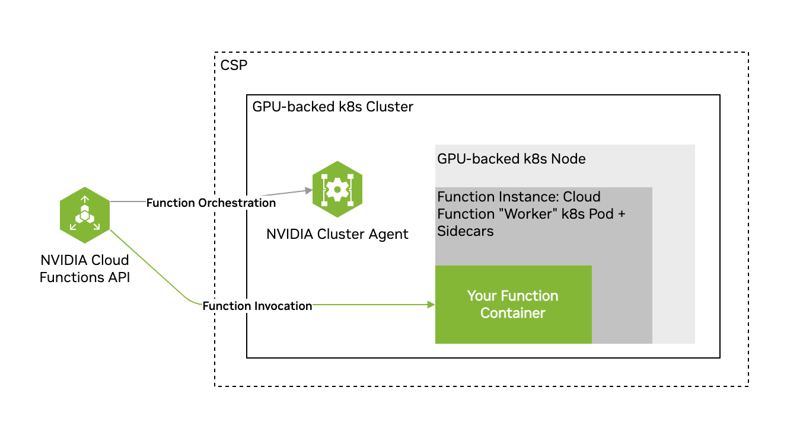
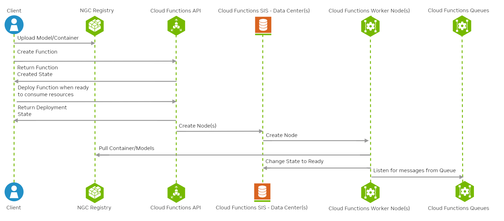

Hello World

# Function Lifecycle [](\#function-lifecycle "Permalink to this headline")

Cloud “functions” are an abstraction that allows you to run your code without managing deployments and infrastructure. Cloud Functions simplifies hosting AI inference and fine-tuning workloads in the cloud by automatically enabling access to GPU capacity and autoscaling. Cloud functions are generally considered stateless.

Therefore, **function authors are only responsible for maintaining their AI models and associated code**. This is highlighted in the diagram below in green. To use Cloud Functions, you create a function, then define a deployment specification for it, and deploy it on one of the available GPU-backed clusters hosted by NVIDIA.

Note

A Cloud Functions account can contain multiple functions, each with multiple function versions. Each function created also creates a single function version.

Cloud Functions supports function invocation (calling of the function’s inference endpoint) at the function ID level or the function version ID level. You can create a single function and version and invoke only this function version, or create multiple versions of the same function and spread invocation across all versions.

## Key Concepts [](\#key-concepts "Permalink to this headline")

See below for an overview of some key basic concepts within Cloud Functions.

| Term | Description |
| --- | --- |
| NVIDIA GPU Cloud (NGC) | A portal of enterprise services, software, and management tools supporting end-to-end AI. |
| NGC Private Registry | Registry integrated with Cloud Functions for storing custom containers, models, resources, and helm charts. |
| NVIDIA Cloud Account ID (NCA ID) | NVIDIA customer billing entity that cloud services are associated with. |
| Function | User-defined encapsulated code that implements a server exposing at least one inference endpoint, either based on a container, or helm chart. |
| Function Instance | A single deployed copy of a function running on a cluster. |
| Function Deployment | One or more function instances running on a cluster. |
| Function Invocation | The action of calling (via the Cloud Functions API) a function’s inference endpoint. |
| Asset | A file that can be uploaded, downloaded, and used by your function when invoked. Required for function input sizes >5MB. |
| Cluster | A collection of GPU-powered Kubernetes nodes/pods. |
| GPU Instance Type | Refers to any one of the supported GPU configurations within Cloud Functions, including the GPU model, number of GPUs on a single node, number of CPU cores, etc. |

## Function States [](\#function-states "Permalink to this headline")

A function can be in any of the following states:

- `ACTIVE` \- If the function can receive invocations. Only when a function is `ACTIVE` can it be invoked.

- `ERROR` \- If all function instances are in an ERROR state.

- `INACTIVE` \- When a function is created but not yet deployed, it is `INACTIVE`. When a function is undeployed, the state is changed from `ACTIVE` to `INACTIVE`.

- `DEPLOYING` \- When a function is being deployed and the instances are still coming up to reach the minimum instance count.

## Workflow [](\#workflow "Permalink to this headline")

The workflow when using Cloud Functions is usually as follows.

- [Function Creation](function-creation.html#function-creation): Define your function with a container, or helm chart.

- [Function Deployment](function-deployment.html#function-deployment): Deploy your function on a cluster.

- [Function Invocation](api.html#invoke): Invoke your function’s inference endpoint.

- [Function Management](function-management.html#life): Manage your deployed function, for example, add new versions.

- [Function Monitoring](function-monitoring.html#function-monitoring): Monitor your function by using the Cloud Functions UI and third-party tooling.

## Function Lifecycle Endpoints [](\#function-lifecycle-endpoints "Permalink to this headline")

### Function Creation, Management & Deployment [](\#function-creation-management-deployment "Permalink to this headline")

The table below provides an overview of the function lifecycle API endpoints and their respective usages.

| Name | Method | Endpoint | Usage |
| --- | --- | --- | --- |
| Register Function | POST | `/v2/nvcf/functions` | Creates a new function. |
| Register Function Version | POST | `/v2/nvcf/functions/{functionId}/versions` | Creates a new version of a function. |
| Delete Function Version | DELETE | `/v2/nvcf/functions/{functionId}/versions/{functionVersionId}` | Deletes a function specified by its ID. |
| List Functions | GET | `/v2/nvcf/functions` | Retrieves a list of functions associated with the account. |
| List Function Versions | GET | `/v2/nvcf/functions/{functionId}/versions` | Retrieves a list of versions for a specific function. |
| Retrieve Function Details | GET | `/v2/nvcf/functions/{functionId}/versions/{functionVersionId}` | Retrieves details of a specific function version. |
| Create Function Version Deployment | POST | `/v2/nvcf/deployments/functions/{functionId}/versions/{functionVersionId}` | Initiates the deployment process for a function version. |
| Delete Function Version Deployment | DELETE | `/v2/nvcf/deployments/functions/{functionId}/versions/{functionVersionId}` | Initiates the undeployment process for a function version. |
| Retrieve Function Version Deployment | GET | `/v2/nvcf/deployments/functions/{functionId}/versions/{functionVersionId}` | Retrieves details of a specific function version deployment. |
| Update Function Version Deployment | PUT | `/v2/nvcf/deployments/functions/{functionId}/versions/{functionVersionId}` | Updates the configuration of a function version deployment. |

#### Function Metadata [](\#function-metadata "Permalink to this headline")

When using the Cloud Functions API to create a function, it’s possible to specify a function description and a list of tags as strings as part of the function creation request body. This metadata is then returned in all responses that include the function definition. This is an API-only feature at this time. Please see the [OpenAPI Specification](api.html#open-api) for usage.

### Function Invocation [](\#function-invocation "Permalink to this headline")

The table below provides an overview of the Function invocation API endpoints and their respective usages.

| Name | Method | Endpoint | Usage |
| --- | --- | --- | --- |
| Invoke Function | POST | `v2/nvcf/pexec/functions/{functionId}` | Invokes the specified function’s inference endpoint and returns the results, if available. Cloud Functions randomly selects one of the active versions of the specified function for inference. |
| Invoke Function Version | POST | `v2/nvcf/pexec/functions/{functionId}/versions/{functionVersionId}` | Invokes the specified version under the specified function for inference and returns the results. |
| Get Function Invocation Status | GET | `/v2/nvcf/pexec/status/{invocationRequestId}` | Used to poll for results of an inference request when a 202 response is returned. If the original invocation request returns a 200 response, calls to this API are not necessary. |

Note

Read more about using the invocation API [here](api.html#invoke).
