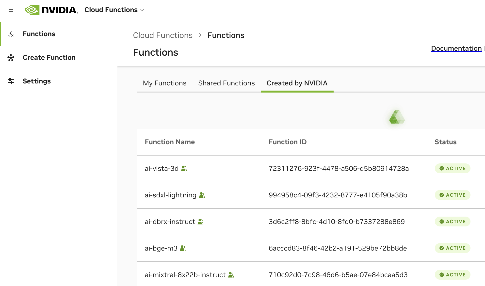

Hello World

# Function Permissions [](\#function-permissions "Permalink to this headline")

This page describes function invocation permissions and public and shared function access within your Cloud Functions account.

Function permissions within Cloud Functions fall into three categories:

1. **Account-owned functions**


- These are functions that are scoped to just your Cloud Functions account, within your NGC organization, listed as “My Functions”. Any user within your NGC organization can invoke account-owned functions by generating a Personal API Key. See [Generate an NGC Personal API Key](api.html#generate-personal-key).


Note

Metrics and logs in the Cloud Functions UI are currently only available for account-owned functions.

1. **Shared functions**


- These are functions that are shared to your Cloud Functions account, from a different Cloud Functions account, listed as “Shared Functions”. Functions shared to your account are invoke-able by any user within your NGC organization, via generating a Personal API Key.


1. **Public functions**


- These are [NVIDIA NIM](https://www.nvidia.com/en-us/ai/) functions that are maintained by NVIDIA and shared to all NGC organizations for public access, listed as “Created by NVIDIA”. The functions listed here are also available to invoke via [NVIDIA’s AI API Catalog](https://build.nvidia.com/explore/discover). Refer to the samples within the catalog for instructions on how to invoke the function.


Tip

Reach out to your NVIDIA account manager to request shared function capabilities for your account’s functions and options for self-hosting NIMs within your account.

All function categories are visible in the UI under the Functions List page tabs and are also visible in the API when listing functions.



## Listing Functions via API [](\#listing-functions-via-api "Permalink to this headline")

All functions available to your Cloud Functions account are listable via API with the following curl.

```
1 curl --location 'https://api.ngc.nvidia.com/v2/nvcf/functions?visibility=authorized&visibility=private&visibility=public' \
2 --header 'Accept: application/json' \
3 --header 'Authorization: Bearer $API_KEY'
```

Available parameters for filtering include:

- `visibility=private` \- Account-owned functions

- `visibility=authorized` \- Functions shared to your account

- `visibility=public` \- Functions created by NVIDIA available to all accounts


