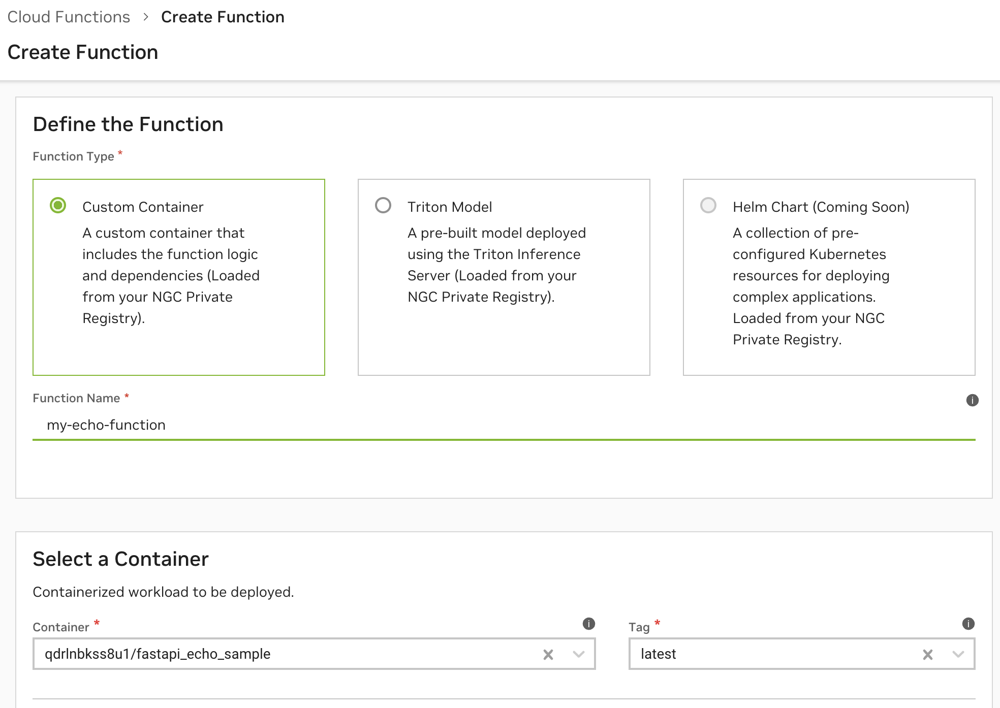
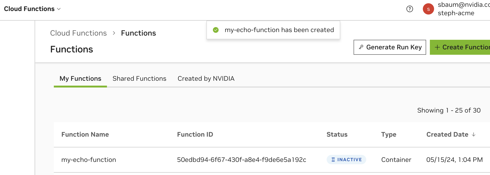

Hello World

## Clone, Build and Push the Docker Image to NGC Private Registry [](\#clone-build-and-push-the-docker-image-to-ngc-private-registry "Permalink to this headline")

1. First clone and build the docker image.


```
1> git clone https://github.com/NVIDIA/nv-cloud-function-helpers.git
2> cd nv-cloud-function-helpers/examples/fastapi_echo_sample
3> docker build . -t fastapi_echo_sample
```

1. Now tag and push the docker image to the NGC Private Registry.


```
1> docker tag fastapi_echo_sample:latest nvcr.io/$ORG_NAME/fastapi_echo_sample:latest
2> docker push nvcr.io/$ORG_NAME/fastapi_echo_sample:latest
```

1. Once this finishes, you’ll now be able to see the new container in the [NGC Private Registry Containers Page](https://registry.ngc.nvidia.com/containers) and it will be available for use in function creation.


## Create & Deploy the Function Using the Cloud Functions UI [](\#create-deploy-the-function-using-the-cloud-functions-ui "Permalink to this headline")

1. Navigate to the [Cloud Functions UI](https://nvcf.ngc.nvidia.com/functions?filter=my-functions) and choose “Create Function”, then “Custom Container”. Enter the details for the `fastapi_echo_sample`. In this container, the inference endpoint is `/echo`, the health endpoint is `/health` and it exposes these on the default `8000` port. No other configuration changes are needed.




1. Once created, the function will show up in the Functions List Page with the status `INACTIVE` because it is not yet deployed. By default, a function ID and function version ID is generated every time you create a new function or new function version.




1. Deploy the function by clicking the kebab menu on the right of the function row.


## Create & Deploy the Function Using the Cloud Functions API [](\#create-deploy-the-function-using-the-cloud-functions-api "Permalink to this headline")

1. Ensure you have an API key created, see [Generate an NGC Personal API Key](api.html#generate-personal-key).

2. Find your NGC organization name within the [NGC Organization Profile Page](https://org.ngc.nvidia.com/profile). This is _not_ the Display Name. For example: `qdrlnbkss123`.

3. Create the function via API by running the following curl with an `$API_KEY` and your `$ORG_NAME`.


```
 1 curl --location 'https://api.ngc.nvidia.com/v2/nvcf/functions' \
 2 --header 'Content-Type: application/json' \
 3 --header 'Accept: application/json' \
 4 --header 'Authorization: Bearer $API_KEY' \
 5 --data '{
 6     "name": "my-echo-function",
 7     "inferenceUrl": "/echo",
 8     "healthUri": "/health",
 9     "inferencePort": 8000,
10     "containerImage": "nvcr.io/$ORG_NAME/fastapi_echo_sample:latest"
11 }'
```

It will return a function ID listed as `id` and a function version ID listed as `versionId`.

1. List functions you’ve created via API using the following curl:


```
1 curl --location 'https://api.ngc.nvidia.com/v2/nvcf/functions?visibility=private' \
2 --header 'Accept: application/json' \
3 --header 'Authorization: Bearer $API_KEY' \
```

1. Deploy the function via API using the following curl:


```
 1 curl --location 'https://api.ngc.nvidia.com/v2/nvcf/deployments/functions/$FUNCTION_ID/versions/$FUNCTION_VERSION_ID' \
 2 --header 'Content-Type: application/json' \
 3 --header 'Accept: application/json' \
 4 --header 'Authorization: Bearer $API_KEY' \
 5 --data '{
 6 "deploymentSpecifications": [
 7         {
 8         "backend": "GFN",
 9         "gpu": "L40G",
10         "maxInstances": "1",
11         "minInstances": "1"
12         }
13     ]
14 }'
```

1. Refer to the [OpenAPI Specification](api.html#open-api) for further API documentation.


## Create & Deploy the Function Using the NGC CLI [](\#create-deploy-the-function-using-the-ngc-cli "Permalink to this headline")

1. Ensure you have an API key created, see [Generate an NGC Personal API Key](api.html#generate-personal-key).

2. Ensure you have the [NGC CLI configured](function-creation.html#ngc-cli-setup).

3. Run the following command to create the function, it will return a function ID and function version ID.


```
1 ngc cf function create --health-uri /health --inference-port 8000 --container-image nvcr.io/$ORG_NAME/fastapi_echo_sample:latest --name my-echo-function --inference-url /echo
```

1. List functions you’ve created using the following command:


```
1 ngc cf function list --access-filter=private
```

1. Deploy the function using the following command:


```
1 ngc cf function deploy create --deployment-specification GFN:L40:gl40_1.br20_2xlarge:1:1 $FUNCTION_ID:$FUNCTION_VERSION_ID
```

1. See [NGC CLI Documentation](https://docs.ngc.nvidia.com/cli/cmd_cloud-function.html). for further commands.


## Invoke the Function [](\#invoke-the-function "Permalink to this headline")

Once your function is deployed, invoke its inference endpoint with the following curl:

```
1 curl --location 'https://api.nvcf.nvidia.com/v2/nvcf/pexec/functions/$FUNCTION_ID' \
2 --header 'Content-Type: application/json' \
3 --header 'Authorization: Bearer $API_KEY' \
4 --data '{
5     "message": "hello world"
6 }'
```


